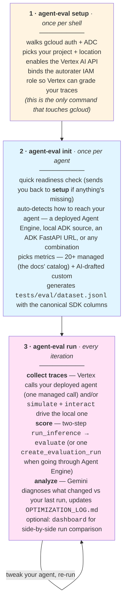

# agent-eval

A hand-on-shoulder CLI walkthrough of the [Vertex AI Generative AI Evaluation Service](https://docs.cloud.google.com/vertex-ai/generative-ai/docs/models/evaluation-genai-sdk) for ADK agents — built on top of the **Vertex AI Gen AI SDK** (the previous standalone Vertex AI Eval SDK is no longer maintained, so all of `agent-eval` targets the new one).

<p align="center">
  
</p>

The Gen AI SDK eval docs cover three things (boxes in the image above):

1. **Prepare an evaluation dataset** — the canonical columns each metric expects (`prompt`, `response`, `reference`, `conversation_history`, `intermediate_events`, `session_inputs`) and how to combine them for managed, custom, computation, and translation metrics.
2. **Pick and configure metrics** — what each metric scores, what columns it reads, and how to mix metric families freely in one evaluation.
3. **Run an evaluation** — the two-step `client.evals.run_inference()` → `client.evals.evaluate()`, or the streamlined one-call `client.evals.create_evaluation_run()` for agents already deployed to Agent Engine.

`agent-eval` folds that knowledge into three commands you run yourself, in order. Each command stops at a clear handoff and tells you what the next one does — `init` does **not** run `setup` for you, it just checks that you did and points back if you didn't.



Each phase inside `run` is also exposed as a standalone command (`simulate`, `interact`, `evaluate`, `agent-engine`, `analyze`, `dashboard`) for when you want finer control. The CLI teaches as you go — `--help` and the in-flow prompts carry the technical detail.

> ⚠️ **Use Vertex AI, not `GOOGLE_API_KEY`** — eval metrics will be empty otherwise. `agent-eval setup` configures this for you.

---

## Before you start

You need three things installed locally:

- **Python 3.10–3.12** — 3.13+ isn't supported by some ADK deps yet.
- **[`uv`](https://docs.astral.sh/uv/)** — package manager. Also gives you `uvx`, a one-shot runner we use below for `agent-starter-pack`.
- **[`gcloud`](https://cloud.google.com/sdk/docs/install)** — for Google Cloud auth and to enable Vertex AI APIs.

You also need an ADK agent. If you don't have one yet, [Agent Starter Pack](https://googlecloudplatform.github.io/agent-starter-pack/) (ASP) is the fastest way from zero — expand the box below for the snippet. Pick the deploy target that matches how you want to evaluate; you can also pick more than one over time and `init` will detect every option that applies.

<details>
<summary><b>Bootstrap an ADK agent with Agent Starter Pack</b></summary>

```bash
uvx agent-starter-pack create my-agent \
    -a adk \
    -d <DEPLOY_TARGET> \
    --cicd-runner google_cloud_build \
    --region us-central1 \
    --auto-approve

cd my-agent
gcloud config set project <YOUR_PROJECT_ID>
make install
make backend     # only needed for `agent_engine` / `cloud_run` — provisions + deploys
# make playground  # optional: kick the tires in ADK's local UI
```

| Flag | Why this value |
|---|---|
| `-a adk` | ADK Python agent — the framework `agent-eval` evaluates |
| `-d none` | Local-only — fastest path to start iterating; no deploy step |
| `-d cloud_run` | Cloud Run FastAPI deployment — same local pipeline as `-d none`, plus an HTTP endpoint you can hit |
| `-d agent_engine` | Managed Vertex AI Agent Engine — additionally unlocks the streamlined `create_evaluation_run` pass (single-turn, no FastAPI server to run) |
| `--cicd-runner google_cloud_build` | Cloud Build needs no external accounts (vs GitHub Actions) — easiest to bootstrap |
| `--region us-central1` | Cheap + most-supported Vertex AI region |
| `--auto-approve` | Skip the wizard prompts |

> **Not sure which `-d` to pick?** Start with `-d none` or `-d cloud_run` — `agent-eval` runs the full local pipeline against either, and you can deploy to Agent Engine later (`agent-eval` will pick it up automatically and add the streamlined pass on top).

</details>

### Install `agent-eval`

Clone this repo and let `uv` create the virtualenv and install everything:

```bash
cd agent-eval
uv sync                  # creates .venv/ and installs all deps
source .venv/bin/activate # so `agent-eval` is on your PATH
```

> Wheel install (`uv pip install agent-eval`) is on the roadmap once we publish — for now, source clone + `uv sync` is the supported install path.

### Prepare your Google Cloud env

Run this **once per shell session** — it walks gcloud auth, picks your project + location, and enables the foundation APIs you need:

```bash
agent-eval setup
```

Six idempotent steps. Re-run it whenever you switch projects, hit a fresh shell, or your gcloud token expires — already-done work is detected and skipped. From here on, every other `agent-eval` command assumes setup has been run.

<details>
<summary><b>Prefer to run the gcloud commands yourself?</b></summary>

```bash
gcloud auth login                                    # personal account, NOT the GCE service account
gcloud auth application-default login
export GOOGLE_CLOUD_PROJECT="your-project-id"
export GOOGLE_CLOUD_LOCATION="us-central1"
gcloud auth application-default set-quota-project $GOOGLE_CLOUD_PROJECT

# Foundation APIs (Service Usage must be first — without it, the others can't be enabled)
gcloud services enable serviceusage.googleapis.com cloudresourcemanager.googleapis.com \
    aiplatform.googleapis.com iam.googleapis.com --project=$GOOGLE_CLOUD_PROJECT

# Optional: ASP deployment prereqs
gcloud services enable cloudbuild.googleapis.com run.googleapis.com \
    artifactregistry.googleapis.com --project=$GOOGLE_CLOUD_PROJECT

# Autorater IAM binding (required so Vertex AI can grade your traces)
export PROJECT_NUMBER=$(gcloud projects describe $GOOGLE_CLOUD_PROJECT --format="value(projectNumber)")
gcloud projects add-iam-policy-binding $GOOGLE_CLOUD_PROJECT \
    --member="serviceAccount:service-$PROJECT_NUMBER@gcp-sa-aiplatform.iam.gserviceaccount.com" \
    --role="roles/aiplatform.serviceAgent"
```

</details>

---

## Init + run

```bash
agent-eval init   # auto-detects your agent + scaffolds dataset/metrics
agent-eval run    # collect traces → score → analyze
```

`init` walks the agent directory and announces what's available. **The local pipeline is always the default** — that's where you iterate, test changes before deploying, and run the full multi-turn loop. If you've also deployed to Agent Engine, the streamlined single-turn pass becomes available *on top* — they compose, they don't compete. There's no chooser; `init` just scaffolds for whatever it finds:

| What `init` finds | What it unlocks |
|---|---|
| **Local ADK source** *(or any ADK FastAPI URL)* — the default | `agent-eval run` — the local iteration loop: multi-turn `simulate` (UserSim) + single-turn `interact` (DIY) + scoring + analysis. Imports `agent.py` directly, so you don't need a server running. Captures full traces, so latency, cache hits, tool stats, and token counts come along for free. **This is what you use to test changes before deploying.** |
| **Deployed Agent Engine** *(in addition)* | `agent-eval agent-engine` — one managed call (`create_evaluation_run`): Vertex runs your deployed agent, scores it, uploads to GCS. **Single-turn only** — `create_evaluation_run` doesn't replay multi-turn conversations and Vertex doesn't ship a built-in user simulator. Adds on top of the local pipeline; doesn't replace it. |
| **Both** *(typical once you've shipped)* | Keep iterating locally with `agent-eval run`. Occasionally re-run `agent-eval agent-engine` to confirm the deployed agent agrees. Use `agent-eval dashboard` to compare them side-by-side. |

`init` then picks metrics (20+ managed from the docs catalog + AI-drafted custom ones tailored to your agent) and writes `tests/eval/dataset.jsonl` with the canonical SDK columns.

### Iterating with `run`

`run` is a thin wrapper over `simulate` → `interact` → `evaluate` → `analyze`. Each is a standalone command if you want finer control (e.g. re-score an existing trace without re-collecting). The output ends with a Gemini analysis that diagnoses what changed since your last run and updates `OPTIMIZATION_LOG.md`.

> If you point `agent-eval run` at a Cloud Run deployment, ADK's debug traces aren't always persisted there — `agent-eval` falls back to state-derived metrics only and tells you so.

### Iterating with `agent-engine`

`agent-engine` auto-creates the destination GCS bucket on first run, then polls every 10 seconds and prints state transitions until the run terminates:

```text
> Using bucket gs://my-project-agent-eval
> Evaluation run submitted.
  Run:      projects/.../evaluationRuns/8203...
  Waiting for evaluation to finish (timeout 900s)...
  state = INFERENCE
  state = RUNNING
  state = SUCCEEDED
> Run SUCCEEDED.
  View results: https://console.cloud.google.com/vertex-ai/evaluations/...
  GCS:      gs://my-project-agent-eval/agent-eval/20260421-073914
```

Pass `--no-wait` for fire-and-forget (useful in CI when you only need the resource name + dashboard URL), or `--timeout <seconds>` if your dataset is huge.

---

## Deeper docs

→ [`docs/reference.md`](docs/reference.md) — the four metric families, the dataset row schema, both execution surfaces in detail (deployed Agent Engine and local), custom metric patterns, the docs-sidebar mapping, ASP integration, and the BYOD roadmap.

## License

Apache 2.0
