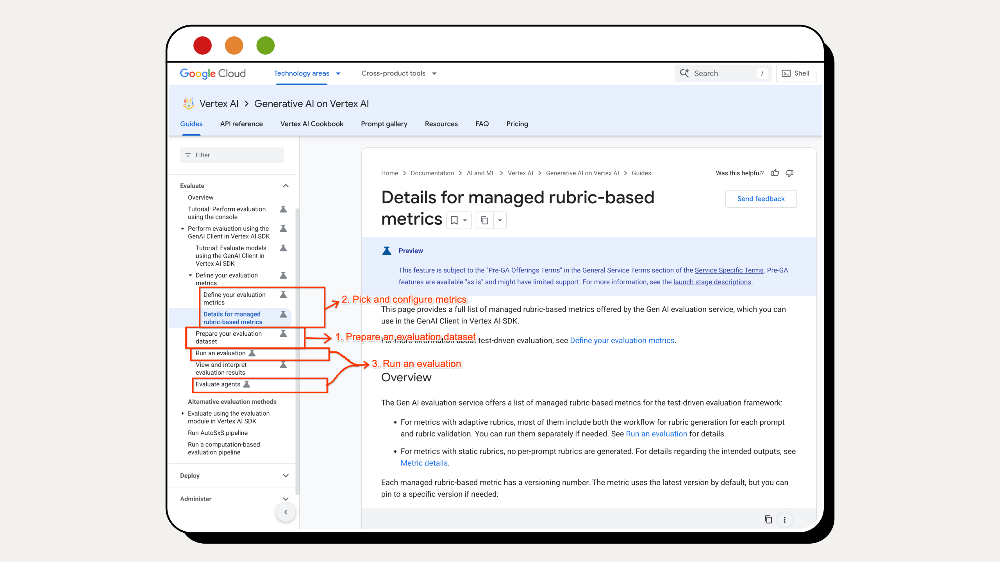
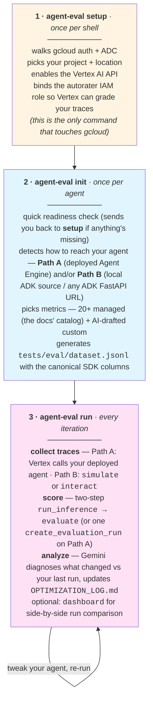

# agent-eval

A hand-on-shoulder CLI walkthrough of the [Vertex AI Generative AI Evaluation Service](https://docs.cloud.google.com/vertex-ai/generative-ai/docs/models/evaluation-genai-sdk) for ADK agents — built on top of the **Vertex AI Gen AI SDK** (the previous standalone Vertex AI Eval SDK is no longer maintained, so all of `agent-eval` targets the new one).

<p align="center">
  
</p>

The Gen AI SDK eval docs cover three things (boxes in the image above):

1. **Prepare an evaluation dataset** — the canonical columns each metric expects (`prompt`, `response`, `reference`, `conversation_history`, `intermediate_events`, `session_inputs`) and how to combine them for managed, custom, computation, and translation metrics.
2. **Pick and configure metrics** — what each metric scores, what columns it reads, and how to mix metric families freely in one evaluation.
3. **Run an evaluation** — the two-step `client.evals.run_inference()` → `client.evals.evaluate()`, or the streamlined one-call `client.evals.create_evaluation_run()` for agents already deployed to Agent Engine.

`agent-eval` folds that knowledge into three commands you run yourself, in order. Each command stops at a clear handoff and tells you what the next one does — `init` does **not** run `setup` for you, it just checks that you did and points back if you didn't.



Each phase inside `run` is also exposed as a standalone command (`simulate`, `interact`, `evaluate`, `analyze`, `dashboard`) for when you want finer control. The CLI teaches as you go — `--help` and the in-flow prompts carry the technical detail.

> **Path A vs Path B at `run`-time.** Path A is one managed call (`create_evaluation_run` — Vertex runs your deployed agent, scores it, uploads results to GCS). Path B is the docs' two-step (`run_inference` → `evaluate`) plus our trace capture layer, so latency, cache hits, tool stats, and token counts come along for free.

---

## Before you start

You need three things installed locally:

- **Python 3.10–3.12** — 3.13+ isn't supported by some ADK deps yet.
- **[`uv`](https://docs.astral.sh/uv/)** — package manager. Also gives you `uvx`, a one-shot runner we use below for `agent-starter-pack`.
- **[`gcloud`](https://cloud.google.com/sdk/docs/install)** — for Google Cloud auth and to enable Vertex AI APIs.

### Install `agent-eval`

Clone this repo and let `uv` create the virtualenv and install everything:

```bash
cd agent-eval
uv sync                  # creates .venv/ and installs all deps
source .venv/bin/activate # so `agent-eval` is on your PATH
```

> Wheel install (`uv pip install agent-eval`) is on the roadmap once we publish — for now, source clone + `uv sync` is the supported install path.

### Prepare your Google Cloud env

Run this **once per shell session** — it walks gcloud auth, picks your project + location, and enables the foundation APIs you need:

```bash
agent-eval setup
```

Six idempotent steps. Re-run it whenever you switch projects, hit a fresh shell, or your gcloud token expires — already-done work is detected and skipped. From here on, every other `agent-eval` command assumes setup has been run.

> ⚠️ **Use Vertex AI, not `GOOGLE_API_KEY`** — eval metrics will be empty otherwise. `agent-eval setup` configures this for you.

<details>
<summary><b>Prefer to run the gcloud commands yourself?</b></summary>

```bash
gcloud auth login                                    # personal account, NOT the GCE service account
gcloud auth application-default login
export GOOGLE_CLOUD_PROJECT="your-project-id"
export GOOGLE_CLOUD_LOCATION="us-central1"
gcloud auth application-default set-quota-project $GOOGLE_CLOUD_PROJECT

# Foundation APIs (Service Usage must be first — without it, the others can't be enabled)
gcloud services enable serviceusage.googleapis.com cloudresourcemanager.googleapis.com \
    aiplatform.googleapis.com iam.googleapis.com --project=$GOOGLE_CLOUD_PROJECT

# Optional: ASP deployment prereqs
gcloud services enable cloudbuild.googleapis.com run.googleapis.com \
    artifactregistry.googleapis.com --project=$GOOGLE_CLOUD_PROJECT

# Autorater IAM binding (required so Vertex AI can grade your traces)
export PROJECT_NUMBER=$(gcloud projects describe $GOOGLE_CLOUD_PROJECT --format="value(projectNumber)")
gcloud projects add-iam-policy-binding $GOOGLE_CLOUD_PROJECT \
    --member="serviceAccount:service-$PROJECT_NUMBER@gcp-sa-aiplatform.iam.gserviceaccount.com" \
    --role="roles/aiplatform.serviceAgent"
```

</details>

---

## Path A — You have an agent deployed to Agent Engine

This is the **streamlined path**. Vertex AI calls your deployed agent for you, runs inference, scores against your metrics, and uploads results to GCS — all in a single managed call (`client.evals.create_evaluation_run`).

> **Single-turn only.** `create_evaluation_run` accepts `prompt` + `session_inputs` rows; it doesn't replay multi-turn conversations and Vertex doesn't ship a built-in user simulator. **Want multi-turn UserSim too?** Run [Path B](#path-b--local-adk-agent-or-any-other-deployment-method) in parallel against the same agent — `agent-eval`'s local UserSim imports your `agent.py` directly (no FastAPI server needed), so any `make backend` user already has both paths available. `agent-eval init` will detect both and offer a **Both** option.

> **Don't have one yet?** [Agent Starter Pack](https://googlecloudplatform.github.io/agent-starter-pack/) (ASP) is the fastest way from zero to a deployed ADK agent. The flags below are pre-picked to show how few decisions Agent Engine actually needs — `-d agent_engine` does the heavy lifting and `--cicd-runner google_cloud_build` is the easiest CI/CD to bootstrap (no GitHub setup):
>
> ```bash
> uvx agent-starter-pack create my-agent \
>     -a adk \
>     -d agent_engine \
>     --cicd-runner google_cloud_build \
>     --region us-central1 \
>     --auto-approve
>
> cd my-agent
> gcloud config set project <YOUR_PROJECT_ID>
> make install
> make backend   # provisions + deploys to Agent Engine — takes a few minutes
> ```
>
> | Flag | Why this value |
> |---|---|
> | `-a adk` | ADK Python agent — the framework `agent-eval` evaluates |
> | `-d agent_engine` | Deploy target: managed Vertex AI Agent Engine (this unlocks Path A) — also handles session storage internally, so no `--session-type` needed |
> | `--cicd-runner google_cloud_build` | Cloud Build needs no external accounts (vs GitHub Actions) — easiest to bootstrap |
> | `--region us-central1` | Cheap + most-supported Vertex AI region |
> | `--auto-approve` | Skip the wizard prompts |
>
> Don't want to use Agent Engine, or already have an agent (deployed elsewhere or running locally)? **Skip to [Path B](#path-b--local-adk-agent-or-any-other-deployment-method) below** — `agent-eval` works there too, just with a different inference path under the hood.

```bash
agent-eval init   # auto-discovers your agent + Reasoning Engine resource
agent-eval run
```

---

## Path B — Local ADK agent (or any other deployment method)

Useful when you're iterating locally, deploying to Cloud Run, or running ADK behind any FastAPI endpoint. `agent-eval` drives ADK's REST endpoints (`/run`, `/debug/trace/...`) directly and captures full traces.

> **Don't have one yet?** Same scaffolder, swap the deployment target for Cloud Run (or `none` if you're staying purely local). `--cicd-runner google_cloud_build` keeps the bootstrap as light as Path A:
>
> ```bash
> uvx agent-starter-pack create my-agent \
>     -a adk \                              # ADK Python agent
>     -d cloud_run \                        # deploy target: Cloud Run (or use `-d none` for local-only)
>     --cicd-runner google_cloud_build \    # Cloud Build CI/CD
>     --region us-central1 \
>     --auto-approve
>
> cd my-agent
> make install
> make playground   # optional: kick the tires in ADK's local UI
> ```

```bash
agent-eval init   # auto-discovers agent.py via rglob
agent-eval run    # interacts with your agent (UserSim + DIY), scores, analyzes
```

> Heads-up: if you later run Path B against a Cloud Run deployment, ADK's debug traces aren't always persisted there — `agent-eval` falls back to state-derived metrics only and tells you so.

---

## Deeper docs

→ [`docs/reference.md`](docs/reference.md) — the four metric families, the dataset row schema, both execution paths in detail (A and B), custom metric patterns, the docs-sidebar mapping, ASP integration, and the BYOD roadmap.

## License

Apache 2.0
