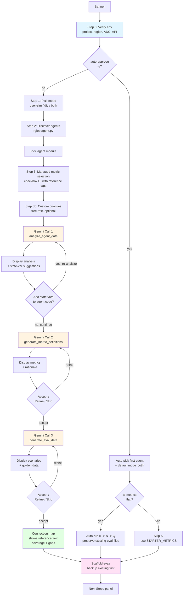

# Reference Guide

Complete documentation for every `agent-eval` command, option, metric type, data format, and customization point.

For installation and getting started, see the [README](../README.md).

---

## Table of Contents

1. [Why this design](#why-this-design)
2. [Mapping to the Vertex AI eval docs sidebar](#mapping-to-the-vertex-ai-eval-docs-sidebar)
3. [Architecture overview](#architecture-overview)
   - [The four metric families](#the-four-metric-families)
   - [The two execution paths](#the-two-execution-paths)
   - [Inference strategy per path (when we use `run_inference` and when we don't)](#inference-strategy-per-path)
   - [Dataset row schema](#dataset-row-schema)
   - [Folder layout (legacy → new)](#folder-layout-legacy--new)
   - [Custom metric patterns](#custom-metric-patterns)
3. [Authentication](#authentication)
3. [CLI Reference](#cli-reference)
   - [init](#init)
   - [run](#run)
   - [simulate](#simulate)
   - [interact](#interact)
   - [evaluate](#evaluate)
   - [analyze](#analyze)
   - [agent-engine](#agent-engine)
   - [import](#import)
   - [migrate](#migrate)
   - [convert](#convert)
   - [create-dataset](#create-dataset)
   - [dashboard](#dashboard)
4. [Metrics](#metrics)
   - [Deterministic Metrics](#deterministic-metrics)
   - [Managed Metrics (Vertex AI)](#managed-metrics-vertex-ai)
   - [Custom LLM-as-Judge Metrics](#custom-llm-as-judge-metrics)
5. [Creating Custom Metrics](#creating-custom-metrics)
   - [Basic Structure](#basic-structure)
   - [Dataset Mapping Constraint](#dataset-mapping-constraint)
   - [Available Source Columns](#available-source-columns)
   - [Per-row capability detection (`requires_reference` / `requires_multi_turn`)](#per-row-capability-detection)
   - [Combining Multiple Sources](#combining-multiple-sources)
   - [Structured Response Evaluation](#structured-response-evaluation)
   - [Binary Decomposition](#binary-decomposition)
   - [Example: Trajectory Accuracy](#example-trajectory-accuracy)
   - [Example: Tool Usage Quality](#example-tool-usage-quality)
6. [Interaction Modes](#interaction-modes)
   - [ADK User Sim](#adk-user-sim)
   - [DIY Interactions](#diy-interactions)
7. [Data Formats](#data-formats)
   - [Golden Dataset](#golden-dataset)
   - [Conversation Scenarios](#conversation-scenarios)
   - [Session Input](#session-input)
   - [Processed JSONL Fields](#processed-jsonl-fields)
8. [Output Files](#output-files)
   - [eval_summary.json](#eval_summaryjson)
   - [gemini_analysis.md](#gemini_analysismd)
   - [OPTIMIZATION_LOG.md](#optimization_logmd)
9. [Run Comparison](#run-comparison)
10. [Managed Metrics Catalog](#managed-metrics-catalog)
11. [Models and Pricing](#models-and-pricing)
12. [ADK Optimization Patterns](#adk-optimization-patterns)
13. [AI Assistant Integration](#ai-assistant-integration)
14. [Troubleshooting](#troubleshooting)
15. [Experimental & on the roadmap](#experimental--on-the-roadmap)
    - [BYOD — `agent-eval ingest-traces`](#byod-bring-your-own-data--agent-eval-ingest-traces)
    - [Other deferred items from the plan](#other-deferred-items-from-the-plan)
    - [SDK features `agent-eval` doesn't surface yet](#sdk-features-agent-eval-doesnt-surface-yet)

---

## Why this design

`agent-eval` exists because we wanted to use the Vertex AI Generative AI Evaluation Service to evaluate our ADK agents — and we wanted the experience of *following the docs* to be the same as the experience of *using the CLI*. This section explains the three problems the SDK-aligned refactor (April 2026) addressed, so you understand the choices reflected in the rest of this doc.

**1. Hardcoded reference requirements.** Earlier versions of `agent-eval` carried a hand-maintained set of "metrics that need a reference field." Every time Google added a new managed metric, our list went stale. The refactor replaces that with `metric_families.classify()` — which introspects the SDK directly via `ComputationMetricHandler.SUPPORTED_COMPUTATION_METRICS`, `TranslationMetricHandler.SUPPORTED_TRANSLATION_METRICS`, and `_evals_constant.SUPPORTED_PREDEFINED_METRICS`. New metrics land in the right family automatically.

**2. The CLI didn't mirror the docs.** Users had to learn two mental models — Google's docs and our flow. The CLI now mirrors the [Vertex AI eval docs sidebar](https://cloud.google.com/vertex-ai/generative-ai/docs/models/evaluation/) one-for-one: *Define metrics* (init Step 3, family-grouped picker) → *Prepare dataset* (init Step 4 / `import`) → *Run evaluation* (`simulate` / `interact` → `evaluate`) → *View results* (`analyze` + `dashboard`) → *Evaluate agents* (`agent-engine` for the streamlined Path A).

**3. Two folders, two data shapes, no clear story for Agent Engine.** The old layout had `app/eval/` (ours) sitting next to `tests/eval/evalsets/` (ADK's), with separate `scenarios/*.json` and `golden_dataset.json` files using different shapes, and unclear handling for Agent Engine deployments. The refactor consolidates everything into one folder (`tests/eval/`), one row shape (`dataset.jsonl`), and two named execution paths (A — Agent Engine; B — Local ADK source / any ADK FastAPI URL) — see [The two execution paths](#the-two-execution-paths). BYOD lives as a roadmap note, not a third path.

**Doc strategy:** the [README](../README.md) is the e2e walk-through — it covers the two paths (Agent Engine + local ADK) end-to-end, including ASP scaffolding for users who don't have an agent yet. The CLI itself carries the in-flow technical detail (`--help`, questionary prompts, Rich panels). This document is the deep reference for when you want to know *why* something works the way it does, plus the catalog of every CLI command, metric, and data shape.

---

## Mapping to the Vertex AI eval docs sidebar

Each section under *"Perform evaluation using the GenAI Client in Vertex AI SDK"* in the eval docs sidebar maps one-for-one to a step in `agent-eval`. Every row links to the official Vertex AI page so you can cross-reference what we're doing on your behalf:

| Docs section | What `agent-eval` does for you |
|---|---|
| [Tutorial: Evaluate models using the GenAI Client](https://cloud.google.com/vertex-ai/generative-ai/docs/models/evaluation-genai-sdk) | `agent-eval init` walks you through environment setup, agent discovery, and a first-run scaffold — the docs' tutorial, but for ADK agents instead of raw model calls. |
| [Define your evaluation metrics](https://cloud.google.com/vertex-ai/generative-ai/docs/models/determine-eval) | `init` Step 3 — managed metrics grouped by family (adaptive / static / computation / translation), with `GENERAL_QUALITY` pre-checked per the docs' recommendation. |
| ↳ [Details for managed rubric-based metrics](https://cloud.google.com/vertex-ai/generative-ai/docs/models/rubric-metric-details) | `metric_families.classify()` introspects the SDK's `_evals_constant.SUPPORTED_PREDEFINED_METRICS`, so the picker stays in sync with the managed `RubricMetric.*` entries automatically. |
| [Prepare your evaluation dataset](https://cloud.google.com/vertex-ai/generative-ai/docs/models/evaluation-dataset) | `init` Step 4 generates a unified `tests/eval/dataset.jsonl` using the canonical SDK columns (`prompt`, `response`, `reference`, `conversation_history`, `session_inputs`, `intermediate_events`) + free-form `expected_*` extras. `agent-eval import --from <evalset>` flattens existing ADK evalsets into the same file. |
| [Run an evaluation](https://cloud.google.com/vertex-ai/generative-ai/docs/models/run-evaluation) | `agent-eval simulate` (multi-turn via ADK UserSim) or `agent-eval interact` (single-turn via ADK FastAPI) capture responses + traces, then `agent-eval evaluate` scores them with `client.evals.evaluate()`. |
| [View and interpret evaluation results](https://cloud.google.com/vertex-ai/generative-ai/docs/models/view-evaluation) | `agent-eval analyze` produces a Gemini diagnosis + cumulative `OPTIMIZATION_LOG.md`; `agent-eval dashboard` opens an interactive comparison view. |
| [Evaluate agents](https://cloud.google.com/vertex-ai/generative-ai/docs/models/evaluation-agents-client) | `agent-eval agent-engine` is the streamlined Path A — calls `client.evals.run_inference()` + `client.evals.create_evaluation_run()` against a deployed Reasoning Engine. For local ADK agents stick with the `evaluate` flow above. |

---

## Architecture overview

`agent-eval` is a thin orchestration layer over the Vertex AI Generative AI Evaluation Service (Preview). The CLI's job is to walk you through the same workflow the docs describe — discover an agent, prepare a dataset, pick metrics, run inference + evaluation, view results — without you having to glue the SDK calls together yourself.

This section is the mental model the rest of the doc assumes.

### The four metric families

Every Vertex AI managed metric belongs to one of four families. Knowing the family tells you what data the metric needs and how the SDK scores it.

| Family | Examples | Reference required? | How scoring works |
|---|---|---|---|
| **Adaptive Rubric** (recommended start) | `GENERAL_QUALITY`, `TEXT_QUALITY`, `INSTRUCTION_FOLLOWING`, `MULTI_TURN_*`, `FINAL_RESPONSE_QUALITY`, `FINAL_RESPONSE_REFERENCE_FREE`, `TOOL_USE_QUALITY` | optional | Judge LLM generates rubrics on the fly from the prompt + response. |
| **Static Rubric** | `GROUNDING`, `SAFETY`, `FINAL_RESPONSE_MATCH`, `HALLUCINATION` | optional / match-only | Judge LLM applies a fixed rubric. |
| **Computation** (deterministic) | `EXACT_MATCH`, `BLEU`, `ROUGE_1`, `ROUGE_L_SUM`, `tool_*` | **required** | Mathematical comparison against `reference`. |
| **Translation** (niche) | `comet`, `metricx` | **required** | Translation-quality scorers. |

`agent-eval init` groups its checkbox picker by family using `metric_families.classify()`, which introspects the SDK directly — adding a new managed metric upstream lands it in the right group automatically.

The Vertex AI docs recommend starting with `GENERAL_QUALITY` only and opting into more metrics as you learn what your agent needs. The CLI follows that recommendation: only `GENERAL_QUALITY` is pre-checked.

### The two execution paths

| Path | When it applies | Trace fidelity | Multi-turn UserSim | Auto-detected via |
|---|---|---|---|---|
| **A — Agent Engine** (streamlined) | Agent is deployed to a Reasoning Engine (typically via Agent Starter Pack `make backend`) | Full (managed) | **No** — `create_evaluation_run` is single-turn; Vertex doesn't ship a user simulator | `AGENT_ENGINE_RESOURCE_NAME` env var, or `deployment/agent_engine_metadata.json` from ASP |
| **B — Local ADK source / any ADK FastAPI URL** | You have local agent source, OR you can point at any ADK FastAPI endpoint (local dev, Cloud Run, remote host) | Varies — see sub-modes below | **Yes** — local UserSim imports `agent.py` directly (no FastAPI server needed) | An `agent.py` reachable from `cwd` via `rglob` |

> **A and B aren't mutually exclusive.** Almost every `make backend` user has both — the deployed Agent Engine artifact AND the local source it was built from. `agent-eval init` detects both and offers a **Both** option that scaffolds `tests/eval/dataset.jsonl` (for Path A) alongside `scenarios/` + `eval_data/` (for Path B). Run them in parallel against the same agent for the most coverage: Path A gives you Vertex's managed dashboard URL, Path B gives you full local trace fidelity and multi-turn UserSim coverage.

> **Non-ADK agent? (BYOD)** There's no third path in the UI. The schema unification means you can hand-write a converter against the row shape in [Dataset row schema](#dataset-row-schema), drop the JSONL into `tests/eval/dataset.jsonl`, and run `agent-eval evaluate` like normal. A streamlined `agent-eval ingest-traces` command is on the [roadmap](#byod-bring-your-own-data--agent-eval-ingest-traces).

`agent-eval init` runs `path_detector.detect_execution_path()` early and announces what it found, so the rest of the flow has shared vocabulary.

**Path B has three sub-modes**, all hitting the same ADK FastAPI routes:

| Sub-mode | Started by | Trace persistence |
|---|---|---|
| Local dev | `make playground`, `python -m google.adk.cli` | Full traces — latency, spans, tool calls |
| Cloud Run | Deployed FastAPI on Cloud Run | **Often missing** — `agent_eval` falls back to state-derived metrics only (`processor.py` already handles this gracefully) |
| Remote ADK | Any other ADK FastAPI URL | Depends on the host |

If you pick the DIY interaction mode in `init`, the CLI surfaces the Cloud Run trace caveat upfront so you're not surprised when latency metrics come back empty.

### Inference strategy per path

The Vertex AI eval docs describe a clean two-step pattern: `client.evals.run_inference()` to generate responses, then `client.evals.evaluate()` to score them. That pattern fits perfectly when you're evaluating a raw model or an Agent Engine deployment — but it doesn't fit a *local ADK agent*, which lives behind ADK's FastAPI server, not behind Vertex's inference API.

So `agent-eval` only uses `client.evals.run_inference()` on Path A. The other paths reach the agent through ADK-native channels and converge at `client.evals.evaluate()` for scoring. This table is the truth of which call drives which command:

| Command | How it gets the agent's responses | How it scores them |
|---|---|---|
| `agent-eval agent-engine` (**Path A**) | `client.evals.run_inference(agent=<resource>, src=df)` — Vertex calls your deployed Reasoning Engine for you. | `client.evals.create_evaluation_run(...)` — inference + scoring + GCS upload, one call. |
| `agent-eval simulate` (**Path B**, multi-turn) | ADK's [User Simulation](https://google.github.io/adk-docs/evaluate/user-sim/) drives a simulated user against your local agent. ADK writes traces to `.adk/eval_history/`; we convert them to JSONL. | `client.evals.evaluate(dataset, metrics)` |
| `agent-eval interact` (**Path B**, single-turn) | Our REST client (`agent_client.py`) hits ADK's FastAPI endpoints directly: `/run`, `/apps/.../sessions/...`, `/debug/trace/session/{id}`. We capture the full trace ourselves. | `client.evals.evaluate(dataset, metrics)` |
| `agent-eval evaluate` | (Reads existing JSONL from `simulate` / `interact`.) | `client.evals.evaluate(dataset, metrics)` |

**Why not `run_inference()` for Path B?**

`client.evals.run_inference()` is built for two cases (per the [Run an evaluation](https://docs.cloud.google.com/vertex-ai/generative-ai/docs/models/run-evaluation) docs): a `model=` string for direct LLM calls, or an `agent=<reasoning-engine-resource>` for Agent Engine deployments. Local ADK agents fit neither — they're a FastAPI process you started locally or in Cloud Run. Reaching them through `run_inference` would require a managed bridge that doesn't exist.

ADK provides better-fitting tools for the local case:

- **UserSim** is the docs-aligned way to drive *multi-turn* agent dialogues with realistic, LLM-played user behavior. It's strictly more capable than passing a flat list of prompts to `run_inference()`.
- **The ADK FastAPI debug endpoints** (`/debug/trace/session/{id}`) give us full execution traces — latency per step, intermediate events, tool calls, session state — which `run_inference()` doesn't surface for non-Agent-Engine deployments.

The end result: every path produces the same `dataset.jsonl` row shape, and every path scores through `client.evals.evaluate()`. The only difference is *how the response and trace columns get populated*. Path A delegates that to Vertex; Path B delegates to ADK; both meet at the evaluation step.

### Dataset row schema

The unified dataset lives at `tests/eval/dataset.jsonl`. Every row is a JSON object with these fields:

```jsonl
{
  "prompt": "Find docs about pricing tiers",
  "reference": "Here are 3 documents about pricing...",
  "session_inputs": {"app_name": "app", "user_id": "u1", "state": {}},
  "conversation_history": [{"role": "user", "parts": [{"text": "..."}]}],
  "expected_docs": ["doc_pricing_v2"],
  "expected_tool_calls": [{"name": "search_docs", "args": {"query": "..."}}]
}
```

**Two layers of fields:**

- **Canonical SDK columns** (`prompt`, `response`, `reference`, `intermediate_events`, `session_inputs`, `conversation_history`, `context`) — used by managed metrics. Names are fixed.
- **Free-form `expected_*` columns** — used by custom `LLMMetric` templates via `{expected_X}` placeholders. The SDK auto-resolves them via `getattr(eval_case, var_name)` (verified at `_evals_metric_handlers.py:547-551`), so any top-level row field is automatically available to custom metric templates.

`response` and `intermediate_events` are added at runtime by `run_inference` (Path A) or `simulate` / `interact` (Path B). Optional fields per row enable mixed datasets — some rows multi-turn, some single-turn, some with reference, some without. Per-row capability detection (`dataset_io.detect_capabilities`) determines metric eligibility at evaluation time.

**Sources of dataset rows:**

1. **Gemini-generated** — `agent-eval init` drafts test cases from your agent code.
2. **ADK evalset import** — `agent-eval import --from <file>.evalset.json` flattens existing ADK evalsets.
3. **Hand-edited** — open `dataset.jsonl` and write rows directly.
4. **Legacy migration** — `dataset_io.migrate_legacy()` converts the old `app/eval/scenarios/` + `app/eval/eval_data/golden_dataset.json` layout into rows, preserving originals under `tests/eval/.backup/<timestamp>/`.

### Folder layout (legacy → new)

The refactor moves eval artifacts into one folder that lives next to ADK's existing convention. Existing projects don't need to reorganize manually — `dataset_io.migrate_legacy()` handles the conversion and preserves originals.

**Before** (two folders, two data shapes — confusing):

```
my-agent/
├── app/
│   └── eval/                        ← scaffolded by old agent-eval
│       ├── scenarios/*.json
│       ├── eval_data/golden_dataset.json
│       └── results/
└── tests/
    └── eval/evalsets/*.evalset.json ← ADK's folder
```

**After** (one folder, one shape — extends ADK's convention):

```
my-agent/
├── app/                             ← agent code (untouched)
└── tests/
    └── eval/
        ├── dataset.jsonl            ← unified row shape (was scenarios/ + golden_dataset.json)
        ├── evalsets/*.evalset.json  ← ADK's existing files (preserved; importable via `agent-eval import`)
        ├── metrics/
        │   └── metric_definitions.json
        └── results/
            └── <timestamp>/…
```

**Rationale:** ADK already creates `tests/eval/`. Extending that folder instead of inventing `app/eval/` means one mental model, no parallel hierarchies, and existing ADK evalsets stay first-class — they become inputs you can import with `agent-eval import --from <file>.evalset.json`.

**Migration:** `dataset_io.migrate_legacy(agent_dir)` walks the old layout, flattens scenario rows + golden_dataset entries into the new row shape, writes them to `tests/eval/dataset.jsonl`, and copies the originals into `tests/eval/.backup/<timestamp>/` so you don't lose data. `expected_behavior` becomes the canonical `reference` column; `expected_docs`, `expected_tool_call`, etc. are kept verbatim as flat top-level columns (the SDK's `getattr(eval_case, var_name)` mechanism makes them automatically available to custom `LLMMetric` templates).

### Custom metric patterns

The Vertex AI docs describe five custom metric patterns. `metric_factory.py` exposes all five, defined in `tests/eval/metrics/metric_definitions.json` using a unified `kind` schema. The CLI's "AI generation" flow drafts pattern #2 (`custom_llm_judge`) for you, but power users can add the others by editing the JSON directly:

| `kind` | Wraps | Use case |
|---|---|---|
| `managed` | `RubricMetric.<NAME>` | Pin a managed metric exactly as-is. |
| `parametrized_managed` | `RubricMetric.<NAME>(metric_spec_parameters=…)` | Add custom guidelines or rubric groups to a managed metric. |
| `custom_llm_judge` | `LLMMetric(prompt_template=MetricPromptBuilder(…))` | Hand-written LLM judge with instruction + criteria + rating scores. |
| `python_function` | `Metric(custom_function=…)` | In-process deterministic check (Python). **Not compatible with Path A** — `metric_factory.to_evaluation_run_metric()` rejects this kind for Agent Engine runs. |
| `remote_code` | `Metric(remote_custom_function=…)` | Sandboxed code execution metric. |

Schema example:

```jsonc
{
  "general_quality_with_guidelines": {
    "kind": "parametrized_managed",
    "base": "general_quality_v1",
    "guidelines": "Must maintain professional tone, no financial advice."
  },
  "language_simplicity": {
    "kind": "custom_llm_judge",
    "instruction": "Evaluate simplicity for a 5-year-old.",
    "criteria": {"Vocabulary": "...", "Sentences": "..."},
    "rating_scores": {"5": "...", "1": "..."}
  },
  "contains_keyword": {
    "kind": "python_function",
    "module": "tests/eval/custom_metrics.py",
    "function": "contains_keyword"
  }
}
```

`metric_factory.build_all()` reads this file and instantiates the right SDK type. Path A automatically wraps each metric via `to_evaluation_run_metric()` so it can be passed to `client.evals.create_evaluation_run()`.

---

## Authentication

The evaluation pipeline requires **Vertex AI** on Google Cloud. Two commands are involved, and they have **separate jobs** — keeping them separate is intentional, so you can re-run setup whenever your shell or token expires without re-doing init's per-agent scaffolding work.

| Command | Job | Cadence |
|---|---|---|
| **`agent-eval setup`** | The only command that *configures* your GCP env. Walks gcloud auth, picks your project + location, enables the Vertex AI API, sets the ADC quota project, and (interactively) binds the autorater IAM role. Idempotent — already-done steps are detected and skipped. | Once per shell session (or after switching projects / refreshing tokens) |
| **`agent-eval init`** | Verifies the env *looks* ready (project set, ADC file present, Vertex AI API enabled). If anything is missing it **aborts immediately** with a one-line pointer back to `agent-eval setup` — it never tries to fix things itself. | Once per agent |

### What `setup` does (six numbered steps)

| Step | Action | Skipped if |
|---|---|---|
| 1 | `gcloud auth login` for your personal account (must NOT be a `*-compute@`/`gce-sa@` service account — those usually can't enable APIs or grant IAM) | A non-service-account gcloud user is already active |
| 2 | `gcloud auth application-default login` — creates the ADC file the Python SDK reads | ADC file is present **and** its `account` (or `client_email`) matches the active gcloud account from step 1 (see "ADC validation" below) |
| 3 | Resolve `GOOGLE_CLOUD_PROJECT` + `GOOGLE_CLOUD_LOCATION`, write them to `.env`, and bind ADC's quota project to your project (`gcloud auth application-default set-quota-project`) | Both env vars already set + quota project already bound |
| 4 | Enable the four foundation APIs: `serviceusage`, `cloudresourcemanager`, `aiplatform`, `iam` (Service Usage must come first or the others can't be enabled) | API already enabled (per `gcloud services list --enabled`) |
| 5 | Bind `roles/aiplatform.serviceAgent` to the AI Platform service agent (the autorater) so Vertex can grade your traces | Binding already in place |
| 6 | (Opt-in) Enable Cloud Build / Cloud Run / Artifact Registry — needed only if you'll deploy with Agent Starter Pack | You answered "no" to the ASP prompt, or the API is already enabled |

Run it once at the top of a fresh shell. Re-running on an already-configured project is cheap.

#### ADC validation (Step 2 — why file existence isn't enough)

Step 2 doesn't trust file existence alone. On Google Compute Engine VMs and Cloud Workstations, `gcloud auth application-default print-access-token` falls back to the GCE metadata service and lies about the identity in use. And `gcloud auth application-default revoke` can leave readable-but-stale artifacts behind. To catch both, step 2:

1. Confirms the ADC file exists at the expected path (`$GOOGLE_APPLICATION_CREDENTIALS` → `$CLOUDSDK_CONFIG/application_default_credentials.json` → `~/.config/gcloud/application_default_credentials.json`).
2. Reads the JSON and pulls out the `account` (user creds) or `client_email` (service-account JSON key).
3. Compares it case-insensitively to the active gcloud account from step 1.

Three failure modes force a re-run of `gcloud auth application-default login`:

| Reason | What you'll see |
|---|---|
| `missing` | "No ADC file at `<path>` — on a VM, gcloud may fall back to metadata creds — that's not what we want." |
| `unreadable` | "ADC file at `<path>` is present but unreadable. It may be a leftover from `gcloud auth application-default revoke`." |
| `mismatch` | "ADC file is for `<adc-email>` but you're logged in as `<gcloud-email>`. These need to match — otherwise the Python SDK will use the wrong identity." |

On match, the OK line includes the email so you can eyeball it: `> ADC file present at /home/.../application_default_credentials.json  (account: you@example.com)`.

#### Resilient-on-failure (every step)

Every step that runs `gcloud` (1, 2, 3-quota-project, 4, 5, 6) is wrapped in the same retry loop. If the command fails, you get an interactive choice:

- **Try again** — re-runs the same gcloud command (useful for transient errors, OAuth flow restarts, etc.)
- **Skip this step (I'll fix it manually before re-running)** — keeps `agent-eval setup` moving so you can finish other steps and come back to the failing one. Common case: you don't have `serviceusage.services.enable` permission on the project — skip, ask a project owner to enable the API, then re-run setup.
- **Exit setup** — calls `_abort_setup()` which prints "Re-run `agent-eval setup` after fixing the issue above." and aborts the click command. No silent half-finished state.

Permission-denied errors are detected explicitly and the prompt nudges you toward Skip + an owner-only command line you can hand off:

```
!     could not enable
      PERMISSION_DENIED: ...
      You don't seem to have permission to enable APIs on this project.
      Ask a project owner to run:  gcloud services enable aiplatform.googleapis.com --project=PROJECT
?    Enable aiplatform.googleapis.com failed. What now?  (Use arrow keys)
 » Try again
   Skip this step (I'll fix it manually before re-running)
   Exit setup
```

`--auto-approve` / `-y` (CI mode) bypasses the menu — failures print the warning and continue, since there's no human to answer.

### What `init` checks (and only checks)

| Check | If missing |
|-------|-----------|
| `GOOGLE_CLOUD_PROJECT` env var | Abort with: *"Run `agent-eval setup` first."* |
| Application Default Credentials file on disk | Abort with the same pointer |
| Vertex AI API enabled on the project | Abort with the same pointer |

There are no prompts, no fixes, no `.env` writes from init. It's purely a guardrail so init can proceed knowing the env is sane.

### Manual setup

If you prefer to configure everything yourself (or are running in CI), set these before running any `agent-eval` command:

```bash
# 1. Authenticate
gcloud auth login
gcloud auth application-default login

# 2. Set your project
export GOOGLE_CLOUD_PROJECT="your-project-id"
export GOOGLE_CLOUD_LOCATION="us-central1"
gcloud auth application-default set-quota-project $GOOGLE_CLOUD_PROJECT

# 3. Enable Vertex AI API
gcloud services enable aiplatform.googleapis.com --project=$GOOGLE_CLOUD_PROJECT

# 4. Grant autorater permissions (one-time)
PROJECT_NUMBER=$(gcloud projects describe $GOOGLE_CLOUD_PROJECT --format="value(projectNumber)")

gcloud projects add-iam-policy-binding $GOOGLE_CLOUD_PROJECT \
    --member="serviceAccount:service-$PROJECT_NUMBER@gcp-sa-aiplatform.iam.gserviceaccount.com" \
    --role="roles/aiplatform.serviceAgent"
```

### Common auth issues

| Symptom | Cause | Fix |
|---------|-------|-----|
| Empty metrics / all scores zero | Using `GOOGLE_API_KEY` instead of Vertex AI | Remove `GOOGLE_API_KEY`, set `GOOGLE_CLOUD_PROJECT` |
| Permission denied on autorater | Service account lacks permissions | Run the autorater IAM command above |
| Gemini model location errors | Gemini 3+ models require `global` region | Auto-configured by default; override with `--location global` |

---

## CLI Reference

### init

Scaffolds the `eval/` folder structure for an ADK agent. Runs a quick readiness check on your Google Cloud env (and aborts pointing you at `agent-eval setup` if anything's missing — `init` never configures gcloud itself), then discovers `agent.py` files in the current directory tree and lets you select which agent to evaluate.

```bash
uv run agent-eval init
```

| Option | Default | Description |
|--------|---------|-------------|
| `--target-dir` | auto-detected | Directory containing agent.py (eval/ created here) |
| `--agent-name` | auto-detected | Agent module name |
| `--mode` | `both` | Interaction mode: `user-sim`, `diy`, or `both` |
| `--auto-approve`, `-y` | `false` | Skip interactive prompts, use defaults |
| `--ai-metrics` | `false` | Generate tailored metrics with AI (multi-step Gemini pipeline) |

#### Environment Setup

Before agent selection, `init` runs a quick readiness check against your Google Cloud environment — `GOOGLE_CLOUD_PROJECT`, the ADC file, and the Vertex AI API. If anything is missing it stops with a one-line pointer to `agent-eval setup`, which is the dedicated command that walks you through gcloud auth, ADC creation, API enablement, the autorater IAM binding, and the optional ASP-prereq APIs. See [Authentication](#authentication) for the full breakdown of what `setup` does.

#### AI-Powered Metric Generation

Step 3 runs a guided metric configuration pipeline (or use `--ai-metrics` with `-y` for non-interactive):

1. **Existing metrics detection** — If you've run `init` before, the CLI loads your existing `metric_definitions.json`, shows what you have, and pre-checks your previous selections.

2. **Managed metrics selection** — Discovers all available metrics from the Vertex AI SDK at runtime and presents an interactive checkbox UI (arrow keys to navigate, space to toggle, enter to confirm). Metrics are grouped into server-side (API Predefined, auto-evaluated by Google) and template-based (GCS YAML, evaluated by LLM judge). First run pre-selects only `GENERAL_QUALITY` (per the Vertex AI docs' recommended starting point — *"Start with `GENERAL_QUALITY` as the default"*); re-runs pre-select whatever you had before.

3. **Custom metrics priorities** — Optionally describe what matters most for your agent (e.g., "accuracy of billing lookups, response tone"). Press Enter to skip — Gemini will pick what to focus on by reading the agent code. Custom metric generation always runs; the accept/refine/skip loop after generation is your off-ramp.

4. **Agent analysis** (Gemini Call 1) — Analyzes your agent's source code to identify tools, state variables, sub-agents, and key behaviors. Surfaces any state-variable additions that would unlock richer metrics, with copy-paste-ready code snippets and an AI-generated disclaimer. After you've added them, the loop re-analyzes so the new state is visible to the next two calls.

5. **Metric generation** (Gemini Call 2) — Generates custom LLM-as-judge metric definitions that complement your selected managed metrics. Defaults to a 0-1 rubric scale, includes at least one `requires_reference: true` metric that compares the agent response against `reference_data.<field>` (the field name is chosen to match your agent's domain — e.g. `expected_response`, `expected_docs`, `expected_tool_calls`). For managed metrics that need a reference (e.g. `FINAL_RESPONSE_MATCH`), Gemini also sets a matching `reference_field` so the evaluator knows which slot in `reference_data` to read.

6. **Evaluation data generation** (Gemini Call 3) — Generates conversation scenarios (multi-turn, for simulation) and golden dataset entries (single-turn, for regression testing). The same `reference_data.<field>` chosen in step 5 is populated here as a starter — you're expected to refine the values with the actual answers you want the agent to produce. The "How everything connects" section flags any reference fields that are required by metrics but missing from the generated golden data.

After generation you can accept, refine (provide feedback and re-run), or skip to starter metrics.

**Non-destructive re-runs:** If eval files already exist, they are backed up to `eval/.backup/<timestamp>/` before AI content is written. Existing custom metrics are preserved (Gemini is asked to keep them as-is or improve them). Scenarios and golden data are merged with existing entries.

**Resilient reference-field handling:** Reference data is a dict — users can put arbitrary domain-specific fields in it (e.g. `expected_docs`, `expected_citations`, `expected_tool_calls`). The evaluator resolves which field to compare against in three layers: (1) the metric's explicit `reference_field` if set; (2) a priority list of conventional names — `expected_response`, `expected_behavior`, `expected_output`, `expected_answer`, `ground_truth`, `reference`, `gold_response`; (3) a final fallback that joins all populated fields as `key: value` pairs so the judge always has *something* to compare against. New managed metrics that need a reference only need to be added to `_MANAGED_METRICS_REQUIRE_REFERENCE` in `src/agent_eval/core/metric_discovery.py`.

```bash
# Interactive — runs the full pipeline above
uv run agent-eval init

# Non-interactive — auto-selects general_quality + safety, runs all three Gemini calls
uv run agent-eval init -y --ai-metrics
```

#### Init Flow Diagram



The orange nodes are Gemini API calls; the green node is where reference-field coverage is verified before scaffolding.

---

### run

Orchestrates the full evaluation pipeline in a single command: simulate, interact, evaluate, and analyze. Each phase can be toggled on/off.

```bash
uv run agent-eval run --agent-dir path/to/agent_module
```

| Option | Default | Description |
|--------|---------|-------------|
| `--agent-dir` | required | Path to agent module directory (containing agent.py) |
| `--eval-dir` | auto-detected | Path to eval/ directory |
| `--run-id` | prompted or timestamp | Name for the results folder |
| `--simulate/--no-simulate` | `--simulate` | Run ADK User Sim scenarios |
| `--interact/--no-interact` | `--interact` | Run DIY interactions (skipped if agent unreachable) |
| `--base-url` | `http://localhost:8501` | Agent API URL for interact mode |
| `--evaluate/--no-evaluate` | `--evaluate` | Run evaluation metrics |
| `--analyze/--no-analyze` | `--analyze` | Run AI-powered analysis |
| `--focus` | none | Metric names to highlight in analysis (e.g., `"latency, cache"`) |
| `--skip-gemini` | `false` | Skip AI-powered analysis in the analyze phase |
| `--app-name` | directory name | Agent app name for interact |
| `--questions-file` | auto-detected | Golden dataset JSON for interact mode |
| `--num-questions` | `-1` (all) | Limit number of questions for interact |
| `--skip-traces` | `false` | Skip trace retrieval in interact mode |
| `--dashboard/--no-dashboard` | prompt | Launch interactive dashboard after pipeline (prompts if gradio installed) |
| `--debug` | `false` | Show detailed logs from all phases |

**Graceful fallback:** If the agent is not reachable at `--base-url`, interact is skipped and the pipeline continues with simulation data.

**Dashboard integration:** After the pipeline completes, `run` checks if Gradio is installed. If so, it prompts to launch the interactive dashboard showing all runs in the results directory. Use `--dashboard` to auto-launch or `--no-dashboard` to skip.

---

### simulate

Runs the full ADK User Sim workflow: symlinks scenario files, clears stale traces, creates a fresh eval set, runs the simulation, and converts traces.

```bash
uv run agent-eval simulate --agent-dir path/to/agent_module
```

| Option | Default | Description |
|--------|---------|-------------|
| `--agent-dir` | required | Path to agent module directory |
| `--eval-dir` | auto-detected | Path to eval/ directory |
| `--run-id` | prompted or timestamp | Name for the results folder |
| `--debug` | `false` | Show ADK subprocess output and internal logs |

**What it does (5 steps):**

1. **Symlinks scenario files** — Creates symlinks for `session_input.json`, `conversation_scenarios.json`, and `eval_config.json` from `eval/scenarios/` into the agent module directory (ADK requires these next to `agent.py`)
2. **Clears eval history** — Removes `.adk/eval_history/` to avoid mixing stale traces
3. **Creates eval set** — Recreates the eval set from scratch (ADK's `add_eval_case` appends, so recreating avoids duplicates)
4. **Runs ADK User Sim** — Runs `adk eval` with an LLM simulating users following your scenarios
5. **Converts traces** — Converts OpenTelemetry traces to agent-eval's JSONL format

**Output:** `eval/results/<run-id>/raw/processed_interaction_sim.jsonl`

> ADK runs its own built-in LLM scoring during `adk eval`. The `simulate` command defaults to an empty `eval_config.json` (`{"criteria": {}}`) to skip this — `agent-eval` handles all scoring via the `evaluate` command instead.

**CI / scripted runs.** Set `AGENT_EVAL_NO_PAUSES=1` to skip the interactive Run ID prompt (and every other `_continue` pause). The command falls back to a timestamp like `20260421_073914`, so you can pipe `simulate → evaluate → analyze` end-to-end without any keystrokes.

---

### interact

Runs interactions against a live agent endpoint. Prompts interactively for any missing configuration.

```bash
uv run agent-eval interact --agent-dir path/to/agent_module
```

Before running, start your agent in a separate terminal:
- **ADK Starter Pack:** `cd path/to/agent && make playground` (port 8501)
- **Custom agents:** start your server on any port

| Option | Default | Description |
|--------|---------|-------------|
| `--agent-dir` | prompted | Agent module directory |
| `--app-name` | directory name | Agent application name |
| `--questions-file` | auto-detected | Golden dataset JSON (prompted if not found) |
| `--base-url` | prompted | Agent API URL |
| `--results-dir` | auto-detected | Output directory |
| `--run-id` | prompted | Name for results folder |
| `--user-id` | `eval_user` | User ID for session |
| `--num-questions` | `-1` (all) | Limit number of questions to run |
| `--runs` | `1` | Number of runs per question |
| `--skip-traces` | `false` | Skip trace retrieval (faster, but no deterministic metrics) |
| `--filter` | none | Metadata filters in `key:value` format (can specify multiple) |
| `--state` | none | State variables in `key:value` format (can specify multiple) |
| `--user` | `$USER` | Operator username |
| `--debug` | `false` | Show detailed interaction and trace logs |

**Output:** `<results-dir>/<run-id>/raw/processed_interaction_<app_name>.jsonl`

---

### evaluate

Runs metrics on processed interaction data.

```bash
uv run agent-eval evaluate \
  --interaction-file path/to/interactions.jsonl \
  --metrics-files path/to/metric_definitions.json \
  --results-dir path/to/results
```

| Option | Default | Description |
|--------|---------|-------------|
| `--interaction-file` | required | Processed JSONL or CSV (can specify multiple times) |
| `--metrics-files` | required | Metric definition JSON (can specify multiple) |
| `--results-dir` | required | Output directory |
| `--input-label` | none | Run label (e.g., "baseline") |
| `--test-description` | none | Description for this run |
| `--debug` | `false` | Show Vertex AI SDK logs (retries, errors) |

**Combining data sources:** Specify `--interaction-file` multiple times to evaluate both simulation and DIY data together:

```bash
uv run agent-eval evaluate \
  --interaction-file results/run1/raw/processed_interaction_sim.jsonl \
  --interaction-file results/run1/raw/processed_interaction_app.jsonl \
  --metrics-files eval/metrics/metric_definitions.json \
  --results-dir results/run1
```

**Output:** `eval_summary.json`, `evaluation_results_*.csv`

> Both `simulate` and `interact` print the exact `evaluate` and `analyze` commands with correct paths at the end of their output. Just copy and paste them.

---

### analyze

Generates reports and AI-powered root cause analysis. Automatically compares against the previous evaluation run.

```bash
uv run agent-eval analyze \
  --results-dir eval/results/baseline \
  --agent-dir ./my_agent
```

| Option | Default | Description |
|--------|---------|-------------|
| `--results-dir` | required | Directory with eval results |
| `--agent-dir` | none | Agent source (adds context to AI analysis) |
| `--compare-to` | auto-detected | Previous run's results dir for comparison |
| `--focus` | none | Metric names to highlight (e.g., `"latency, cache"`) |
| `--strategy-file` | none | Optimization strategy markdown |
| `--report-audience` | none | Target audience for the report |
| `--report-tone` | none | Tone of the report |
| `--report-length` | none | Length of the report |
| `--model` | `gemini-3.1-pro-preview` | Gemini model for analysis |
| `--location` | auto-configured | Vertex AI region (auto-selects `global` for Gemini 3+ models, `us-central1` otherwise) |
| `--skip-gemini` | `false` | Skip AI analysis, still generate metrics table |
| `--gcs-bucket` | none | GCS bucket for uploading results |
| `--debug` | `false` | Show Gemini API logs |

**Output:** `question_answer_log.md`, `gemini_analysis.md`, `OPTIMIZATION_LOG.md` (in parent results dir)

See [Run Comparison](#run-comparison) for details on how comparison works.

---

### agent-engine

Streamlined Path A runner for agents deployed to **Agent Engine** (Reasoning Engines). Wraps `client.evals.create_evaluation_run()` — Vertex handles inference, scoring, and GCS upload in one managed call.

```bash
agent-eval agent-engine [OPTIONS]
```

| Option | Default | Description |
|---|---|---|
| `--dataset` | `tests/eval/dataset.jsonl` | Unified dataset JSONL with `prompt` / `session_inputs` rows. |
| `--metrics` | `tests/eval/metrics/metric_definitions.json` | Metric definitions (managed rubrics + custom LLM judges via `template` + `score_range`). Falls back to `eval/metrics/metric_definitions.json` for legacy projects. |
| `--resource-name` | env `AGENT_ENGINE_RESOURCE_NAME` or auto-detection | Agent Engine resource (`projects/.../reasoningEngines/...`). |
| `--dest` | `gs://<project>-agent-eval/<timestamp>` | GCS destination for results. Override the bucket with env `AGENT_EVAL_DEST_BUCKET`. The bucket is **auto-created** in `--location` on first run if it doesn't exist. |
| `--project` | env `GOOGLE_CLOUD_PROJECT` | GCP project ID. |
| `--location` | env `GOOGLE_CLOUD_LOCATION` or `us-central1` | GCP location (also used for the dest bucket). |
| `--timeout` | `900` | Seconds to wait for the run to finish before giving up. The command polls `client.evals.get_evaluation_run(name=...)` every 10s and prints state transitions (`PENDING → INFERENCE → RUNNING → SUCCEEDED`). |
| `--no-wait` | _off_ | Submit the run and exit immediately. Prints the resource name + dashboard URL. Use this in CI when you don't want to block. |
| `--agent-module` | auto-detects `pkg.agent:root_agent` from local `agent.py` | Local agent import path used to build `AgentInfo` for the run. Override with `pkg.module:attr` for non-ASP layouts. |
| `--debug` | _off_ | Show full SDK logs (otherwise suppressed). |

**When to use this instead of `evaluate`:**

- Your agent is deployed via [Agent Starter Pack](https://adk.dev/deploy/agent-engine/asp/) (`uvx agent-starter-pack enhance --adk -d agent_engine && make backend`).
- You want managed inference — no local FastAPI server required, no traces to capture yourself.
- You want a single `dashboard_url` to share with stakeholders.

**Custom LLM metrics on Path A.** Both managed rubrics (`is_managed: true` + `managed_metric_name: "GENERAL_QUALITY"`) and AI-generated custom metrics (`template` + `score_range`) are translated into Vertex SDK objects automatically: managed names map to `vt.RubricMetric.<NAME>`, custom judges build a `vt.LLMMetric` via `metric_factory.custom_llm_judge` (the `template` becomes the criterion body, `score_range.min`/`max` becomes the rating scale) and are wrapped with `metric_factory.to_evaluation_run_metric`. Python in-process metrics (`kind: python_function`) are still skipped with a warning, since `create_evaluation_run` cannot execute local Python.

**SDK pattern.** `agent-engine` follows the [evaluation-agents-client docs pattern](https://docs.cloud.google.com/vertex-ai/generative-ai/docs/models/evaluation-agents-client) verbatim: the `Client` is constructed with `http_options=HttpOptions(api_version="v1beta1")`, the local agent is imported (default `app.agent:root_agent`, override with `--agent-module`), and an `AgentInfo` is attached to `create_evaluation_run`. Without `agent_info` the deployed agent's events come back without `content.parts` and the SDK fails the run with "Failed to parse agent run response []" — the local-agent enrichment is what makes the deployed run actually score. If `AgentInfo.load_from_agent` fails because an ADK tool takes a `tool_context: ToolContext` parameter (a known ADK ↔ google-genai schema bug), the command falls back to a manual `AgentInfo(...)` build with empty `tool_declarations`. The agent's name, instruction, and description still flow through.

> **SDK pin.** `pyproject.toml` constrains `google-cloud-aiplatform[evaluation,agent-engines]>=1.132.0,<1.140.0`. Versions ≥1.140 changed the `AgentInfo` schema (drops `agent_resource_name`, requires an `agents`/`root_agent_id` map) and tightened `AgentData` validation in `run_inference` to reject ADK's rich event fields. Bumping past this will need `_build_agent_info` rewritten for the new schema.

The dataset only needs `prompt` (and optionally `session_inputs`) — `reference` is not required for managed rubrics, but custom judges that declare `requires_reference: true` will only score rows that have a reference column.

---

### import

Converts an ADK `.evalset.json` file into the unified `dataset.jsonl` format.

```bash
agent-eval import --from <path-to-evalset.json> [OPTIONS]
```

| Option | Default | Description |
|---|---|---|
| `--from` | _required_ | ADK `.evalset.json` file to import. |
| `--out` | `tests/eval/dataset.jsonl` | Destination dataset JSONL. |
| `--overwrite` | _off_ (appends) | Replace the output file instead of appending. |

The importer flattens each ADK `eval_case` into one row: the **last** user turn becomes `prompt`, earlier turns become `conversation_history`, `session_input` (ADK's singular form) maps to `session_inputs`, and any tool calls collected across the conversation become `expected_tool_calls`. Existing ADK evalsets become first-class inputs alongside Gemini-generated rows and hand-edited rows.

---

### migrate

Converts a project from the legacy `eval/scenarios/` + `eval/eval_data/golden_dataset.json` layout into the unified `tests/eval/dataset.jsonl`. Originals are copied to `tests/eval/.backup/<timestamp>/` so nothing is lost.

```bash
agent-eval migrate [OPTIONS]
```

| Option | Default | Description |
|---|---|---|
| `--agent-dir` | `.` | Project root (auto-detects `app/eval/` or `eval/` underneath). |
| `--out` | `tests/eval/dataset.jsonl` | Destination unified dataset JSONL. |
| `--dry-run` | _off_ | Print the migration plan (rows, files, backup path) without writing anything. |
| `--no-backup` | _off_ | Skip copying originals into `tests/eval/.backup/` (rarely needed). |

**What it does:**

1. Auto-detects the legacy folder via `dataset_io._find_legacy_eval_dir()` — tries `<agent-dir>/app/eval/`, then `<agent-dir>/eval/`.
2. Flattens `scenarios/conversation_scenarios.json` (`starting_prompt` → `prompt`, `conversation_plan` preserved as a column) and `eval_data/golden_dataset.json` (last `user_inputs` → `prompt`, multi-turn user_inputs → `conversation_history`, `expected_behavior` → `reference`) into the unified row shape.
3. Copies `metric_definitions.json` from `<legacy>/metrics/` into `tests/eval/metrics/` if not already there.
4. Copies the original files to `tests/eval/.backup/<timestamp>/` (unless `--no-backup`), so `agent-eval simulate` keeps working against the legacy layout while you transition.

`init` also offers to run this for you when it detects a legacy layout.

---

### convert

Converts ADK simulator history (`.adk/eval_history/`) to evaluation JSONL. Called automatically by `simulate` — only needed if you ran ADK manually.

```bash
uv run agent-eval convert \
  --agent-dir path/to/agent_module \
  --output-dir path/to/results
```

| Option | Default | Description |
|--------|---------|-------------|
| `--agent-dir` | required | Agent module containing `.adk/eval_history/` |
| `--output-dir` | `results/` | Output directory |
| `--questions-file` | none | Golden dataset for merging reference data |

---

### create-dataset

Converts ADK test files to golden dataset format.

```bash
uv run agent-eval create-dataset \
  --input path/to/test.json \
  --output path/to/golden.json \
  --agent-name my_agent
```

| Option | Default | Description |
|--------|---------|-------------|
| `--input` | required | Path to ADK test JSON |
| `--output` | required | Path for output golden dataset |
| `--agent-name` | required | Agent name for metadata |
| `--metadata` | none | Tags in `key:value` format (can specify multiple) |
| `--prefix` | `q` | Question ID prefix (produces `q_001`, `q_002`, etc.) |

---

### dashboard

Launches an interactive Gradio dashboard for comparing evaluation runs. Auto-discovers all runs in the results directory.

```bash
uv run agent-eval dashboard --results-dir eval/results/
```

| Option | Default | Description |
|--------|---------|-------------|
| `--results-dir` | required | Path to results directory containing run sub-folders |
| `--port` | `7860` | Port for the dashboard server |
| `--share` | `false` | Create a public Gradio share link |

**Requires optional dependencies:**

```bash
pip install agent-eval[dashboard]
# or: uv pip install gradio plotly
```

**Tabs:**

| Tab | Description |
|-----|-------------|
| Overview | Scorecards with delta % (Cost, Latency, Quality) + full metrics comparison table |
| Metrics Comparison | Grouped bar chart with run/metric selection and normalize toggle |
| Per-Question Drilldown | Score table with question_id rows and run columns, filtered by metric |
| Analysis | Renders gemini_analysis.md for any selected run |
| Raw Data | Full flattened DataFrame with all metrics and metadata |

Auto-selects the oldest run as baseline and the newest as compare target. All scorecards and tables update reactively when you change the baseline or compare run.

---

## Metrics

### Deterministic Metrics

Automatically calculated from OpenTelemetry session traces. No configuration needed.

| Metric Group | Key Fields | Description |
|-------------|------------|-------------|
| `token_usage` | `total_tokens`, `prompt_tokens`, `completion_tokens`, `cached_tokens`, `llm_calls`, `models_used`, `estimated_cost_usd` | Token consumption and cost |
| `latency_metrics` | `total_latency_seconds`, `average_turn_latency_seconds`, `llm_latency_seconds`, `tool_latency_seconds`, `time_to_first_response_seconds` | Where time is spent |
| `cache_efficiency` | `cache_hit_rate`, `total_cached_tokens`, `total_fresh_prompt_tokens`, `total_input_tokens` | KV-cache performance |
| `tool_success_rate` | `tool_success_rate`, `total_tool_calls`, `failed_tool_calls`, `failed_tools_list` | Tool reliability |
| `thinking_metrics` | `reasoning_ratio`, `total_thinking_tokens`, `total_candidate_tokens`, `total_output_tokens`, `turns_with_thinking` | Model reasoning analysis |
| `tool_utilization` | `total_tool_calls`, `unique_tools_used`, `tool_counts` | Tool usage patterns |
| `grounding_utilization` | `total_grounding_chunks`, `total_grounded_responses`, `total_llm_responses` | RAG grounding usage |
| `context_saturation` | `max_total_tokens`, `peak_usage_span` | Context window utilization |
| `agent_handoffs` | `total_handoffs`, `unique_agents_count`, `agents_invoked_list` | Sub-agent delegation |
| `output_density` | `average_output_tokens`, `total_output_tokens`, `llm_calls_count` | Output verbosity |
| `sandbox_usage` | `total_sandbox_ops`, `unique_ops_used`, `sandbox_tools_used` | Code execution / sandbox tool usage |

### Managed Metrics (Vertex AI)

Built into the Vertex AI SDK, discovered at runtime by `agent-eval`. These require `is_managed: true` in the metric definition. The `init` command configures them automatically.

Managed metrics resolve via two distinct paths:

**Server-side (API Predefined)** — Evaluated on Google's servers. Use `use_gemini_format: true`. The SDK sends raw `request`/`response` Content objects; the server auto-extracts what it needs.

| Metric | Score | Description |
|--------|-------|-------------|
| `GENERAL_QUALITY` | 0-1 rubric | Overall response quality |
| `SAFETY` | 0-1 rubric | Safety and harmlessness |
| `HALLUCINATION` | 0-1 rubric | False claims detection |
| `TOOL_USE_QUALITY` | 0-1 rubric | Tool selection and arguments |
| `GROUNDING` | 0-1 rubric | Claims supported by context |
| `INSTRUCTION_FOLLOWING` | 1-5 pointwise | Adherence to instructions |
| `TEXT_QUALITY` | 1-5 pointwise | Writing quality and clarity |
| `FINAL_RESPONSE_MATCH` | 0-1 similarity | Response matches reference |
| `FINAL_RESPONSE_QUALITY` | 0-1 rubric | Final response quality (ADK) |
| `FINAL_RESPONSE_REFERENCE_FREE` | 0-1 rubric | Quality without reference (ADK) |
| `MULTI_TURN_GENERAL_QUALITY` | 0-1 rubric | Multi-turn conversation quality |
| `MULTI_TURN_TEXT_QUALITY` | 1-5 pointwise | Multi-turn text quality |

**Client-side (GCS YAML)** — Evaluated locally using an LLM-as-judge with templates downloaded from GCS. Use `use_gemini_format: false`. These need standard `prompt`/`response`/`reference` column mapping.

| Metric | Score | Description |
|--------|-------|-------------|
| `COHERENCE` | 1-5 pointwise | Logical flow and consistency |
| `FLUENCY` | 1-5 pointwise | Language fluency and naturalness |
| `GROUNDEDNESS` | 1-5 pointwise | Claims supported by context |
| `VERBOSITY` | -2 to 2 | Response length appropriateness |
| `SUMMARIZATION_QUALITY` | 1-5 pointwise | Summary coverage and accuracy |
| `QUESTION_ANSWERING_QUALITY` | 1-5 pointwise | QA accuracy and completeness |
| `MULTI_TURN_CHAT_QUALITY` | 0-1 rubric | Multi-turn conversation quality |
| `MULTI_TURN_SAFETY` | 0-1 rubric | Multi-turn safety |

> `agent-eval` automatically detects which resolution path each metric uses and applies the correct format. You don't need to worry about this when using `init` — it's handled for you.

**Choosing single-turn vs multi-turn:**

| Agent Pattern | Metrics to Use |
|---------------|----------------|
| User -> Agent (pipeline, single request) | `GENERAL_QUALITY`, `TEXT_QUALITY`, `INSTRUCTION_FOLLOWING` |
| User <-> Agent <-> User (back-and-forth) | `MULTI_TURN_GENERAL_QUALITY`, `MULTI_TURN_TEXT_QUALITY` |

> Using `MULTI_TURN_*` metrics on a single-turn agent causes: `"Variable conversation_history is required but not provided"`

### Custom LLM-as-Judge Metrics

Your own scoring rubrics, defined in `metric_definitions.json`. These use `metric_type: "llm"` and include a `template` with the evaluation prompt. See [Creating Custom Metrics](#creating-custom-metrics) below.

---

## Creating Custom Metrics

> **Two schemas live side by side today.** This section documents the **trace-driven schema** (`metric_type`, `dataset_mapping`, `requires_reference` / `requires_multi_turn`, `template`) used by `agent-eval evaluate` against the JSONL produced by `simulate` / `interact`. The **unified schema** (`kind: managed | parametrized_managed | custom_llm_judge | python_function | remote_code`) is used by `agent-eval agent-engine` (Path A) — see [Custom metric patterns](#custom-metric-patterns) above. Both schemas read the same `tests/eval/metrics/metric_definitions.json` file; `metric_factory.py` discriminates on the `kind` field, while the trace-driven evaluator path keys off `metric_type`.

### Basic Structure

```json
{
  "metrics": {
    "my_metric": {
      "metric_type": "llm",
      "agents": ["my_agent"],
      "score_range": {"min": 0, "max": 5, "description": "0=Fail, 5=Perfect"},
      "dataset_mapping": {
        "prompt": {"source_column": "user_inputs"},
        "response": {"source_column": "final_response"}
      },
      "template": "Evaluate the response.\n\n{prompt}\n{response}\n\nScore: [0-5]"
    }
  }
}
```

> Add `"requires_reference": true` or `"requires_multi_turn": true` to skip rows that don't carry the data the metric needs — see [Per-row capability detection](#per-row-capability-detection) below.

### Dataset Mapping Constraint

```
+------------------------------------------------------------------+
|  The Vertex AI Evaluation SDK only accepts three column names     |
|  in dataset_mapping:                                              |
|                                                                    |
|    prompt    — the user's request                                 |
|    response  — the agent's output                                 |
|    reference — supporting context (tools, state, etc.)            |
|                                                                    |
|  Using any other name will crash the SDK.                         |
|  Combine multiple data sources into these three columns.          |
+------------------------------------------------------------------+
```

> `prompt` and `response` are auto-populated from `user_inputs` and `final_response` if omitted from `dataset_mapping`. `reference` must be explicitly mapped when needed.

### Available Source Columns

These are the values you can use in `source_column`:

| Source | Description |
|--------|-------------|
| `user_inputs` | User messages (JSON list) |
| `final_response` | Agent's final text response (or structured JSON) |
| `trace_summary` | Execution trajectory |
| `extracted_data:tool_interactions` | Tool calls with inputs/outputs |
| `extracted_data:tool_declarations` | Available tools with descriptions |
| `extracted_data:state_variables` | Session state variables |
| `extracted_data:conversation_history` | Full multi-turn conversation |
| `extracted_data:sub_agent_trace` | Agent reasoning steps |
| `extracted_data:thinking_trace` | Detailed reasoning trace |
| `extracted_data:grounding_chunks` | Supporting context chunks |
| `extracted_data:<any_key>` | Any agent-specific state variable |

**Nested field access:** Use `:` to access nested fields:

```json
"response": {"source_column": "final_response:top_recommendation"}
```

<a id="per-row-capability-detection"></a>
### Per-row capability detection (`requires_reference` / `requires_multi_turn`)

Routing decisions are **per-row, not per-metric**. The evaluator inspects each row via `dataset_io.detect_capabilities` to see what data is actually present (reference / multi-turn user_inputs / session_inputs / intermediate_events / response), then matches that against the metric's required capability flags.

| Flag | What it requires from the row | Use it for |
|---|---|---|
| `"requires_reference": true` | The row has reference / expected data (`reference_data` dict, `reference` column, or `expected_*` field). | Correctness checks, fact-grounding, expected-tool-call comparisons. |
| `"requires_multi_turn": true` | The row's `user_inputs` has > 1 turn, **or** the row came from `simulate` (`source_type == "simulation"`). | Trajectory / conversation flow / turn-by-turn coherence metrics. |
| _neither_ (default) | No requirement — runs on every row. | General quality, safety, tone — anything that scores the response on its own. |

**Why this matters:** the same `tests/eval/dataset.jsonl` file can hold a mix of single-turn and multi-turn rows, with reference data on some and not others. With per-row capability filtering, a `correctness` metric quietly skips rows without reference data instead of erroring; a `trajectory_accuracy` metric quietly skips single-turn rows. The evaluator reports skipped rows in its summary so you know what got filtered and why.

> **Backward compatibility.** The legacy `applies_to` field still works — `applies_to: "golden_dataset"` is interpreted as `requires_reference: true`, and `applies_to: "scenarios"` as `requires_multi_turn: true`. Run `agent-eval migrate` to drop `applies_to` from existing metric files.

### Combining Multiple Sources

When you need to evaluate against multiple data sources, combine them into the `reference` column using `template` + `source_columns`:

```json
"dataset_mapping": {
  "prompt": {"source_column": "user_inputs"},
  "response": {"source_column": "final_response"},
  "reference": {
    "template": "Available Tools: {extracted_data_tool_declarations}\n\nTool Calls: {extracted_data_tool_interactions}",
    "source_columns": ["extracted_data:tool_declarations", "extracted_data:tool_interactions"]
  }
}
```

**Rules:**
- `source_columns` lists the data sources to pull from
- `template` is a Python format string with `{variable}` placeholders
- Colons in source column names become underscores in template variables (e.g., `extracted_data:search_results` -> `{extracted_data_search_results}`)

### Structured Response Evaluation

When your agent returns structured JSON, access specific fields with `:` notation:

```json
"dataset_mapping": {
  "prompt": {"source_column": "user_inputs"},
  "response": {"source_column": "final_response:top_recommendation"}
}
```

This evaluates just the `top_recommendation` field from the JSON response, enabling fine-grained scoring of individual response components.

### Binary Decomposition

Instead of vague quality scores, break requirements into specific True/False assertions:

```json
"my_checklist_metric": {
  "metric_type": "llm",
  "score_range": {"min": 0, "max": 3, "description": "Sum of 3 binary checks"},
  "dataset_mapping": {
    "prompt": {"source_column": "user_inputs"},
    "response": {"source_column": "final_response"}
  },
  "template": "Evaluate the response.\n\nUser: {prompt}\nAgent: {response}\n\nChecklist:\n1. [_] Direct answer provided?\n2. [_] Solution offered?\n3. [_] Closing statement?\n\nMark [x] for each Yes. Sum the total.\n\nScore: [0-3]\nExplanation: [Show your checklist]"
}
```

This makes results auditable — the LLM shows its work.

### Example: Trajectory Accuracy

Evaluates whether the agent took the right execution path:

```json
{
  "trajectory_accuracy": {
    "metric_type": "llm",
    "agents": ["my_agent"],
    "requires_multi_turn": true,
    "score_range": {"min": 0, "max": 5, "description": "0=Wrong, 5=Perfect"},
    "dataset_mapping": {
      "prompt": {"source_column": "user_inputs"},
      "response": {"source_column": "trace_summary"},
      "reference": {"source_column": "extracted_data:tool_declarations"}
    },
    "template": "Evaluate the agent's execution trajectory.\n\n**User Request:**\n{prompt}\n\n**Agent Trajectory:**\n{response}\n\n**Available Tools:**\n{reference}\n\n**Scoring:**\n- 5: Perfect execution path\n- 3: Mostly correct with minor issues\n- 0: Completely wrong path\n\nCRITICAL: Only evaluate against tools that exist.\n\nScore: [0-5]\nExplanation: [Your reasoning]"
  }
}
```

### Example: Tool Usage Quality

Evaluates tool selection and argument quality using combined reference data:

```json
{
  "tool_use_quality": {
    "metric_type": "llm",
    "agents": ["my_agent"],
    "score_range": {"min": 0, "max": 5, "description": "0=Poor, 5=Excellent"},
    "dataset_mapping": {
      "prompt": {"source_column": "user_inputs"},
      "response": {"source_column": "final_response"},
      "reference": {
        "template": "Available Tools: {extracted_data_tool_declarations}\n\nTool Calls: {extracted_data_tool_interactions}",
        "source_columns": ["extracted_data:tool_declarations", "extracted_data:tool_interactions"]
      }
    },
    "template": "Evaluate tool usage.\n\n**Request:** {prompt}\n**Response:** {response}\n\n{reference}\n\n**Criteria:**\n1. Tool Selection: Were appropriate tools chosen?\n2. Arguments: Were parameters correct?\n3. Efficiency: Were calls non-redundant?\n\nScore: [0-5]\nExplanation:"
  }
}
```

### Tips for Custom Metrics

1. **Be specific** — Define exactly what each score level means
2. **Request structured output** — Use `Score: [X]` format for reliable parsing
3. **Include available_tools** — Prevents penalizing for non-existent tools
4. **Handle mock data** — Add "Do NOT penalize for mock data in test environments" to templates
5. **Use compound mapping** — For large state objects, select specific fields via `extracted_data:<key>`

---

## Interaction Modes

### ADK User Sim

Generates multi-turn conversations from scenario definitions. An LLM simulates realistic users following your conversation scripts.

**When to use:** Multi-turn conversational agents, rapid prototyping (no golden dataset needed), exploring agent behavior across many scenarios.

> These files live under `eval/scenarios/` rather than `tests/eval/` because ADK's runtime (`adk eval`) expects them at fixed paths next to `agent.py`. The unified `tests/eval/dataset.jsonl` is the right home for Path A and DIY rows; UserSim scenarios stay where ADK reads them.

**Files needed:**

```
eval/scenarios/
├── conversation_scenarios.json   # Scenario definitions
├── session_input.json            # Session config (app_name, user_id)
└── eval_config.json              # ADK eval criteria (auto-created)
```

**Run it:**

```bash
uv run agent-eval simulate --agent-dir path/to/agent_module
```

The `simulate` command handles the full ADK workflow automatically.

### DIY Interactions

Sends queries from a golden dataset to a live agent endpoint. Responses and traces are captured as JSONL.

**When to use:** Single-turn pipeline agents, deployed/remote agents, regression testing with known-good responses.

**Run it:**

```bash
# Interactive — prompts for missing config
uv run agent-eval interact --agent-dir path/to/agent_module

# Non-interactive
uv run agent-eval interact \
  --agent-dir path/to/agent_module \
  --questions-file eval/eval_data/golden_dataset.json \
  --base-url http://localhost:8501 \
  --run-id baseline
```

---

## Data Formats

### Golden Dataset

For DIY interactions. Defines test queries with optional expected behavior:

```json
{
  "golden_questions": [
    {
      "id": "test_001",
      "user_inputs": ["I want to open a coffee shop in Seattle"],
      "agents_evaluated": ["app"],
      "reference_data": {
        "reference_tool_interactions": [
          {"tool_name": "IntakeAgent", "input_arguments": {"target_location": "Seattle"}}
        ],
        "reference_trajectory": ["app", "IntakeAgent", "LocationStrategyPipeline"],
        "expected_behavior": "Should run full location analysis pipeline"
      }
    }
  ]
}
```

| Field | Required | Description |
|-------|----------|-------------|
| `id` | Yes | Unique test case identifier |
| `user_inputs` | Yes | List of user messages (usually one for single-turn) |
| `agents_evaluated` | Yes | Which agents this test applies to |
| `reference_data` | No | Ground truth for comparison |

> Use `uv run agent-eval create-dataset` to convert ADK test files to this format.

### Conversation Scenarios

For ADK User Sim. Defines multi-turn conversation scripts:

```json
{
  "scenarios": [
    {
      "starting_prompt": "I need help with my order.",
      "conversation_plan": "Ask about order status. If asked for order ID, provide '12345'. Then ask about return policy."
    }
  ]
}
```

| Field | Description |
|-------|-------------|
| `starting_prompt` | First message the simulated user sends |
| `conversation_plan` | Natural language instructions for the conversation arc |

**Tips:** Be specific about user intent. Include conditional logic ("If asked for X, provide Y"). Cover edge cases.

### Session Input

```json
{
  "app_name": "my_agent_folder_name",
  "user_id": "eval_user"
}
```

**Critical:** `app_name` must match the **folder name** containing `agent.py`, not the agent's internal display name.

### Processed JSONL Fields

The evaluation pipeline produces JSONL with these fields:

| Field | Description | Used By |
|-------|-------------|---------|
| `question_id` | Unique test case ID | All metrics |
| `source_type` | `"simulation"` or `"interaction"` | Per-source summaries |
| `user_inputs` | User messages (JSON list) | LLM metrics |
| `final_response` | Agent's final response (text or JSON) | LLM metrics |
| `reference_data` | Ground truth (DIY mode only) | Reference metrics |
| `session_id` | Session UUID | Debugging |
| `extracted_data` | State, tools, traces, etc. | Custom metrics |
| `session_trace` | Full execution trace | Deterministic metrics |
| `trace_summary` | Simplified trajectory | Trajectory analysis |
| `request` | Gemini batch format request | Managed metrics (API Predefined) |
| `response` | Gemini batch format response | Managed metrics (API Predefined) |

---

## Output Files

Results are saved to `eval/results/<run-id>/`:

```
eval/results/<run-id>/
├── eval_summary.json           # START HERE — aggregated metrics
├── question_answer_log.md      # Per-question transcript with scores
├── gemini_analysis.md          # AI root cause analysis
└── raw/
    ├── processed_interaction_*.jsonl  # Converted traces
    ├── evaluation_results_*.csv       # Full results spreadsheet
    ├── gemini_prompt.txt              # Prompt sent to Gemini (debug)
    ├── session_*.json                 # Session state dumps
    └── trace_*.json                   # Execution trace dumps
```

### eval_summary.json

Primary output with aggregated metrics:

```json
{
  "experiment_id": "eval-20260127_143022",
  "run_type": "baseline",
  "test_description": "Baseline evaluation",
  "interaction_datetime": "2026-01-27T14:30:22.123456",
  "git_info": {
    "commit": "a1b2c3d4...",
    "branch": "main",
    "dirty": false
  },
  "overall_summary": {
    "deterministic_metrics": {
      "token_usage.total_tokens": 15420,
      "latency_metrics.total_seconds": 12.5,
      "tool_success_rate.rate": 1.0
    },
    "llm_based_metrics": {
      "trajectory_accuracy": 4.2,
      "general_quality": 0.85
    }
  },
  "per_question_summary": [...],
  "per_source_summary": {...}
}
```

**`git_info`:** Captured automatically during `evaluate`. Records the commit hash, branch, and whether there were uncommitted changes. The `analyze` command uses this to diff commits between runs and explain what code changes caused metric movements. For best results, commit your agent changes before each evaluation run.

**`per_source_summary`:** Generated when evaluating multiple data sources together. Shows per-source metric averages alongside the overall summary.

### gemini_analysis.md

AI-generated root cause analysis with:
- Critical issues ranked by impact
- File and line number references
- Optimization recommendations mapped to ADK design patterns
- Comparison analysis (when a previous run exists)

### OPTIMIZATION_LOG.md

Cumulative log maintained in the parent results directory (`eval/results/`). Each `analyze` run appends an iteration with metric deltas, git info, and comparison summary. Uses emoji indicators: improvement, regression, neutral.

---

## Run Comparison

The `analyze` command automatically compares against the most recent previous run. This powers:

1. **Terminal metrics table** — Shows baseline, current, and change columns. Metrics matching `--focus` keywords are highlighted with a marker.

2. **Two Gemini calls** — Call 1 diagnoses the current run. Call 2 analyzes what changed between runs using `git diff`. Both are combined into `gemini_analysis.md`.

3. **OPTIMIZATION_LOG.md** — Cumulative log with iteration history.

**Direction classification:** Metrics are classified as "lower is better" (tokens, latency, cost, failed calls) or "higher is better" (quality scores, cache hit rate). Changes under 1% are marked neutral.

**Smart comparison skip:** If both runs share the same git commit and no code diff is detected, the comparison Gemini call is skipped to avoid wasting API calls analyzing LLM non-determinism.

**Override auto-detection:**

```bash
uv run agent-eval analyze --results-dir eval/results/v3 --compare-to eval/results/v1
```

---

## Managed Metrics Catalog

`agent-eval` discovers managed metrics from the installed Vertex AI SDK at runtime via the `metric_discovery` module. This ensures you always have access to the latest metrics without manual updates.

The discovery process:
1. Reads all attributes from `vertexai.types.RubricMetric` (20+ `LazyLoadedPrebuiltMetric` objects)
2. Checks each against `SUPPORTED_PREDEFINED_METRICS` to classify as server-side (API Predefined) or client-side (GCS YAML)
3. Applies the correct `use_gemini_format` setting automatically

A static fallback catalog (`src/agent_eval/managed_metrics_catalog.json`) is included as reference but is deprecated in favor of runtime discovery.

---

## Models and Pricing

### Analysis Models

The `analyze` command uses Gemini for AI-powered analysis. Default: `gemini-3.1-pro-preview`. The region is auto-configured (`global` for Gemini 3+ models, `us-central1` for older models).

| Model | Region | Status |
|-------|--------|--------|
| `gemini-3.1-pro-preview` | `global` | **Default** |
| `gemini-3-flash-preview` | `global` | Active (faster, lower cost) |
| `gemini-2.5-pro` | `us-central1` | Sunsetting 2026-06-17 |
| `gemini-2.5-flash` | `us-central1` | Sunsetting 2026-06-17 |

Override with `--model` and `--location`:

```bash
uv run agent-eval analyze --results-dir eval/results/v2 --model gemini-3-flash-preview
```

### Cost Estimation

The `evaluate` command estimates per-run cost using model pricing stored in `src/agent_eval/core/deterministic_metrics.py`. Current pricing (April 2026):

| Model | Input / 1M tokens | Output / 1M tokens | Notes |
|-------|-------------------|---------------------|-------|
| `gemini-3.1-pro` | $2.00 | $12.00 | Current default |
| `gemini-3.1-flash-lite` | $0.25 | $1.50 | Lightweight |
| `gemini-3-flash` | $0.50 | $3.00 | |
| `gemini-2.5-pro` | $1.25 | $10.00 | Sunsetting 2026-06-17 |
| `gemini-2.5-flash` | $0.30 | $2.50 | Sunsetting 2026-06-17 |
| `gemini-2.0-flash` | $0.15 | $0.60 | Sunsetting 2026-06-01 |

Source: [Vertex AI Generative AI Pricing](https://cloud.google.com/vertex-ai/generative-ai/pricing)

---

## ADK Optimization Patterns

The `analyze` command includes ADK-specific design patterns in its Gemini prompt, enabling actionable recommendations with code examples. These patterns are bundled in `src/agent_eval/core/adk_optimization_patterns.py` and cover:

- **Tool design** — Error handling, output truncation, docstring constraints
- **Agent architecture** — Sub-agent isolation, sequential/parallel pipelines
- **Prompt engineering** — Capability constraints, clarification rules
- **State & context management** — Initialization, compaction
- **Model configuration** — Temperature, determinism

Recommendations map evaluation signals (e.g., high latency, low tool grounding) to the five **Context Engineering Principles**: Offload, Reduce, Retrieve, Isolate, Cache.

| Signal | Metric to Check | Recommended Fix |
|--------|-----------------|-----------------|
| Agent invents capabilities | `capability_honesty` < 3.0 | Add `KNOWN LIMITATIONS` to tool docstrings |
| Agent takes wrong paths | `trajectory_accuracy` < 3.0 | Isolate into specialized sub-agents |
| Tools called with bad args | `tool_use_quality` < 3.0 | Add Pydantic schemas, stricter types |
| High latency, bloated context | `prompt_tokens` > 10K | Compact stale tool outputs, offload to disk |
| Agent fabricates data on failure | `pipeline_integrity` < 3.0 | Add circuit breaker checks |
| Low cache hits | `cache_hit_rate` < 50% | Put static instructions in `global_instruction` |

---

## AI Assistant Integration

This repository includes context files for AI coding assistants:

- **`CLAUDE.md`** — Loaded automatically by Claude Code
- **`GEMINI.md`** — Loaded automatically by Gemini CLI

These provide project context so assistants can give relevant advice when you share evaluation results.

### Gemini CLI

```bash
npm install -g @google/gemini-cli
export GOOGLE_CLOUD_PROJECT=your-project-id
export GOOGLE_CLOUD_LOCATION=us-central1
export GOOGLE_GENAI_USE_VERTEXAI=true
gemini  # Run from project root
```

### Claude Code

```bash
npm install -g @anthropic-ai/claude-code

# Option A: Vertex AI
export ANTHROPIC_VERTEX_PROJECT_ID=your-project-id
export CLOUD_ML_REGION=us-central1

# Option B: API Key
export ANTHROPIC_API_KEY=your-api-key

claude  # Run from project root
```

### Tips

1. **Share data** — Paste `eval_summary.json` and `gemini_analysis.md` for data-driven help
2. **Be specific** — "Improve trajectory_accuracy by fixing tool selection" beats "make it better"
3. **Iterate** — Run eval -> share results -> get suggestions -> implement -> repeat

### Dashboard

For visual, interactive comparison of evaluation runs:

```bash
uv run agent-eval dashboard --results-dir eval/results/
# Open http://127.0.0.1:7860
```

Requires: `pip install agent-eval[dashboard]`. See the [dashboard](#dashboard) CLI reference for all options.

---

## Troubleshooting

### Token usage shows all zeros

**Cause:** `app_name` in `session_input.json` doesn't match the folder name containing `agent.py`.
**Fix:** Update `app_name` to match the folder name, not the agent's display name.

### "Variable conversation_history is required"

**Cause:** Using `MULTI_TURN_*` metrics on a single-turn agent.
**Fix:** Use `GENERAL_QUALITY` instead of `MULTI_TURN_GENERAL_QUALITY`.

### Empty metrics / all scores are zero

**Cause:** Using `GOOGLE_API_KEY` instead of Vertex AI.
**Fix:** Remove `GOOGLE_API_KEY` and set `GOOGLE_CLOUD_PROJECT` instead.

### "ModuleNotFoundError"

**Cause:** Running from the wrong directory.
**Fix:** `cd` to the directory containing the agent module before running commands.

### ADK evaluation shows stale results

**Cause:** Didn't clear `eval_history` before running.
**Fix:** Use `uv run agent-eval simulate` which clears eval_history automatically. If running ADK manually: `rm -rf agent_module/.adk/eval_history/*`

### Vertex AI authentication errors

**Fix:** Re-run `agent-eval init` — it will detect and fix missing credentials, project ID, and API configuration. Or see [Manual setup](#manual-setup) for the full list of commands.

### Permission denied on autorater model

**Cause:** Vertex AI service account lacks permissions.
**Fix:** See the autorater permissions command in [Manual setup](#manual-setup). This is also shown during `agent-eval init`.

### Gemini model location errors

**Cause:** Gemini 3+ models require `global` region.
**Fix:** Auto-configured by default. Override with `--location global` if needed.

### ADK UserSim: "Error rendering metric prompt template"

**Cause:** ADK runs its own built-in LLM scoring during `adk eval`, which is separate from `agent-eval`.
**Fix:** The `simulate` command defaults to an empty `eval_config.json` (`{"criteria": {}}`) which skips ADK's scoring. `agent-eval` handles all scoring via the `evaluate` command instead.

### Trajectory accuracy penalizing for missing tools

**Cause:** LLM judge expects tools that don't exist.
**Fix:** Include `extracted_data:tool_declarations` in your metric's `reference` mapping, and add "CRITICAL: Only evaluate against AVAILABLE tools listed above" to the template.

### Mock data being penalized

**Cause:** Test environments return mock data.
**Fix:** Add to your metric template: "Do NOT penalize the agent for correctly relaying mock data in test environments."

### Using --debug

Add `--debug` to any command to see detailed logs from ADK, Vertex AI SDK, and other services. By default, third-party logs are suppressed to keep the CLI output clean.

```bash
uv run agent-eval run --agent-dir ./my_agent --debug
```

---

## Experimental & on the roadmap

This section is a developer signpost — features sketched in the SDK-aligned plan that are intentionally deferred. They don't block the main workflow, and we'd rather build them once we have real-world signal.

### BYOD (Bring-Your-Own-Data) — `agent-eval ingest-traces`

**Status:** designed, not yet implemented (Step 10 of the SDK-aligned refactor).

**The problem this solves.** Today's CLI assumes you have either an ADK agent (Path B) or an Agent Engine deployment (Path A). But plenty of agents in the wild aren't ADK-based — LangGraph, custom LLM pipelines, in-house frameworks. They typically emit OpenTelemetry traces. We want those agents to be evaluable too, without forcing a rewrite.

**The proposed flow:**

1. User runs `agent-eval ingest-traces ./my-traces/` against a directory of OTel JSONL or arbitrary trace dumps.
2. CLI inspects the first 3 traces, calls Gemini with: *"Here's a sample trace. Generate a Python conversion script that produces rows matching this JSON schema: `{prompt, response, conversation_history, intermediate_events, session_inputs}`."*
3. CLI writes the draft to `tests/eval/byod_converter.py` for the user to review and tweak.
4. User runs `python tests/eval/byod_converter.py ./my-traces/ tests/eval/dataset.jsonl` to produce rows compatible with the rest of the pipeline.
5. From there, evaluation works exactly like Path B — the dataset is just `dataset.jsonl`, the metrics live in `metric_definitions.json`, and the SDK doesn't care where the rows came from.

**Why it's deferred.** The dataset schema unification (`dataset_io.py`, the canonical SDK columns + free-form `expected_*` extras, the `getattr`-based custom metric resolution) is the *enabler* — once that's in place, BYOD is mechanical. But designing the converter prompt well requires real OTel trace samples. Building it speculatively risks producing a converter that handles toy examples and breaks on the messy traces people actually have. We'd rather wait for the first user with a non-ADK agent and design `ingest-traces` against their data.

**If you want to BYOD today (manual path):** the schema unification means you can hand-write a converter against the row shape documented in [Dataset row schema](#dataset-row-schema), drop the JSONL into `tests/eval/dataset.jsonl`, and run `agent-eval evaluate` like normal. The CLI doesn't validate the agent framework — it only reads rows.

### Other deferred items from the plan

- **5-option custom-metrics flow in `init`** — `metric_factory.py` already supports all five `kind` values (`managed`, `parametrized_managed`, `custom_llm_judge`, `python_function`, `remote_code`). The init flow currently exposes only the Gemini-drafted `custom_llm_judge` path because the questionary forms for the other four would add ~200 lines of UI for capability that power users can already access by hand-editing `metric_definitions.json`. If you want that UI surfaced interactively, file an issue.
- **Folder collapse for Path B** — the unified `tests/eval/` layout shipped for Path A (Agent Engine — `dataset.jsonl` + `metrics/metric_definitions.json` + `results/`). Path B's local UserSim still reads `eval/scenarios/conversation_scenarios.json` and `eval/scenarios/session_input.json` directly because ADK's runtime expects those filenames at those paths. Once ADK exposes a hook for an alternative scenarios source, Path B will collapse into `tests/eval/` too.

### SDK features `agent-eval` doesn't surface yet

The Vertex AI eval SDK has a few more capabilities we've intentionally left at the SDK level — they're powerful, but adding CLI surface for them would conflate concerns or duplicate functionality the SDK already exposes cleanly. Listed here so you know what's possible and where to reach past the CLI when you need to.

| SDK capability | Where to find it | Why we don't wrap it |
|---|---|---|
| **`client.evals.generate_rubrics()` + `rubric_groups`** | [Define your evaluation metrics](https://cloud.google.com/vertex-ai/generative-ai/docs/models/determine-eval) | You can pre-generate per-prompt rubrics for an entire dataset and reuse them across runs (cheaper, more consistent than regenerating every time). The CLI defaults to in-flight rubric generation because most users iterate on prompts faster than they iterate on rubrics — but the `parametrized_managed` `kind` already accepts `rubric_groups` if you want this. |
| **`client.evals.batch_evaluate()` (async, large-scale)** | [Run an evaluation](https://docs.cloud.google.com/vertex-ai/generative-ai/docs/models/run-evaluation) | For datasets too large to score synchronously. We default to `evaluate()` because typical agent-eval datasets are 10–200 rows; if you have thousands of rows, call `batch_evaluate()` directly with the JSONL `agent-eval` produces. |
| **Multi-candidate comparison via `evaluate(dataset=[run_a, run_b], …)`** | [View and interpret results](https://cloud.google.com/vertex-ai/generative-ai/docs/models/view-evaluation) | Single-call comparison with built-in win/tie rates. Today `agent-eval analyze` and `agent-eval dashboard` compare runs *post-hoc* by reading their `eval_summary.json` files, which is friendlier when runs were generated days apart. The SDK's single-call path is better for A/B harness experiments — pass the JSONL files yourself when you need it. |
| **Versioned `RubricMetric(version='v1')`** | [Details for managed rubric-based metrics](https://cloud.google.com/vertex-ai/generative-ai/docs/models/rubric-metric-details) | Pinning a metric to a specific judge version makes results reproducible across SDK upgrades. `metric_factory.py` already accepts a `version` field on the `parametrized_managed` `kind` — the init flow just doesn't ask for it because `version=None` (latest) is what you want when you're iterating. |
| **GCS-YAML legacy metrics** (COHERENCE, FLUENCY, FULFILLMENT, GROUNDEDNESS, SAFETY, SUMMARIZATION_QUALITY, etc.) | [Older Vertex evaluation module](https://cloud.google.com/vertex-ai/docs/generative-ai/models/evaluation) | Predecessors to the GenAI Eval SDK we use. They work but aren't the recommended path; the SDK's `RubricMetric.SAFETY` etc. supersede them. Not exposed in our family-grouped picker because they'd duplicate names and confuse the "start with `GENERAL_QUALITY`" recommendation. |

If any of these become a frequent ask, they're cheap to wrap — the underlying SDK calls already work, we'd just be surfacing them in the CLI. File an issue with the use case.

---

## Additional Resources

- [ADK Documentation](https://google.github.io/adk-docs/)
- [ADK User Simulation](https://google.github.io/adk-docs/evaluate/user-sim/)
- [Vertex AI Evaluation](https://cloud.google.com/vertex-ai/docs/generative-ai/evaluation/)
- [Agent Starter Pack](https://github.com/GoogleCloudPlatform/agent-starter-pack)
